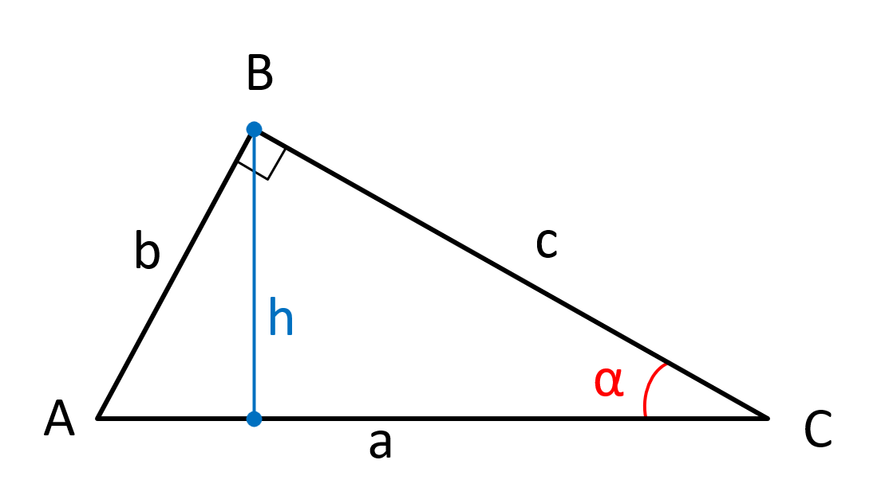
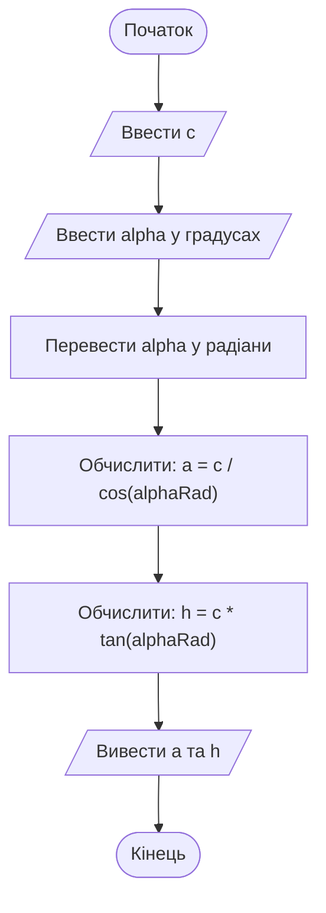
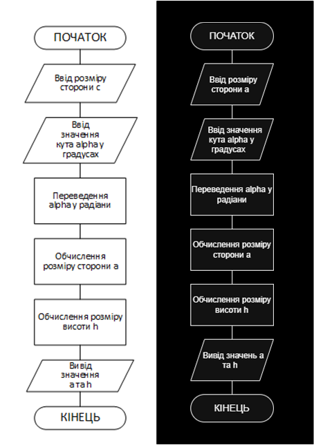

# Лабораторна робота №1. Знайомство з мовою C++

## Мета роботи

Ознайомитися з базовою структурою програми мовою C++, принципами оголошення та використання змінних, введенням і виведенням даних, виконанням арифметичних операцій і простих математичних обчислень. Набути практичних навичок створення, компіляції, запуску та первинного тестування програм у середовищах **Visual Studio** та **Visual Studio Code** з компілятором `g++`.

## Задачі роботи

1. Ознайомитися із загальною структурою побудови програми на мові C++.
2. Навчитися підключати стандартні бібліотеки та використовувати їх можливості.
3. Навчитися оголошувати змінні та задавати їм початкові значення.
4. Освоїти введення даних з клавіатури за допомогою `cin`.
5. Освоїти виведення тексту та значень змінних за допомогою `cout`.
6. Навчитися виконувати різноманітні арифметичні обчислення.
7. Ознайомитися з основними математичними функціями стандартної бібліотеки.
8. Навчитися будувати схему алгоритму простої обчислювальної програми.
9. Навчитися самостійно формувати набори тестових даних та перевіряти результати роботи програми.
10. Реалізувати програму відповідно до індивідуального варіанта.

> *Обмеження цієї лабораторної роботи:* у програмі не вимагається використання умовних розгалужень, повторень послідовностей команд та інших конструкцій для проведення перевірок введених даних чи виконання завдань. Оператори умовного розгалуженя (`if`, `switch`) та циклів (`for`, `while`, `do ... while`) будуть розглянуті в наступних лабораторних роботах.

## Перелік індивідуальних варіантів завдання

Перелік індивідуальних завдань лабораторної роботи містить 10 варіантів, в яких необхідно виконати обчислення характеристик геометричних фігур. Передбачається виконання розрахунків зі змінними вказаних типів, а всі необхідні параметри вводяться з клавіатури.

| № | Індивідуальне завдання |
| ---: | --- |
| 1 | Обчислити периметр і площу ромба. В першому випадку використати змінні типу `int`, у другому випадку використати змінні типу `float`. Усі необхідні параметри вводяться з клавіатури. |
| 2 | Обчислити периметр та площу довільного трикутника. В першому випадку використати змінні типу `int`, у другому випадку використати змінні типу `float`. Усі необхідні параметри вводяться з клавіатури. |
| 3 | Обчислити периметр та площу прямокутного трикутника. В першому випадку використати змінні типу `int`, у другому випадку використати змінні типу `float`. Усі необхідні параметри вводяться з клавіатури. |
| 4 | Обчислити периметр та площу паралелограма. В першому випадку використати змінні типу `int`, у другому випадку використати змінні типу `float`. Усі необхідні параметри вводяться з клавіатури. |
| 5 | Обчислити периметр та площу трапеції. В першому випадку використати змінні типу `int`, у другому випадку використати змінні типу `float`. Усі необхідні параметри вводяться з клавіатури. |
| 6 | Обчислити площу бічної поверхні та об'єм куба. В першому випадку використати змінні типу `int`, у другому випадку використати змінні типу `float`. Усі необхідні параметри вводяться з клавіатури. |
| 7 | Обчислити площу бічної поверхні та об'єм прямокутного паралелепіпеда. В першому випадку використати змінні типу `int`, у другому випадку використати змінні типу `float`. Усі необхідні параметри вводяться з клавіатури. |
| 8 | Обчислити площу бічної поверхні та об'єм циліндра. В першому випадку використати змінні типу `int`, у другому випадку використати змінні типу `float`. Усі необхідні параметри вводяться з клавіатури. |
| 9 | Обчислити площу бічної поверхні та об'єм конуса. В першому випадку використати змінні типу `int`, у другому випадку використати змінні типу `float`. Усі необхідні параметри вводяться з клавіатури. |
| 10 | Обчислити площу поверхні та об'єм кулі. В першому випадку використати змінні типу `int`, у другому випадку використати змінні типу `float`. Усі необхідні параметри вводяться з клавіатури. |

> *Зауваження щодо використання спеціальних функцій*: для завдань із тригонометричними функціями необхідно пам'ятати, що `sin()`, `cos()` та `tan()` використовують радіани; якщо користувач вводить кут у градусах, необхідно виконати відповідне перетворення; для завдань із використанням `sqrt()` аргумент має бути невід'ємним. Для завдань із використанням `log()` аргумент повинен бути строго додатним.

---

## Приклад виконання завдання

### 1. Умова завдання

Написати програму, яка обчислює висоту прямокутного трикутника `h`, проведену до його основи (найбільшої сторони) `a`, та довжину цієї основи, якщо відомі довжина бічної сторони трикутника `c` та кут `α`, який ця сторона утворює з основою.



### 2. Аналіз умови завдання та необхідні теоретичні відомості

Для прямокутного трикутника розрахунок довжини основи `a` та висоти `h`, проведеної до основи можна розрахувати використовуючи наступні формули:

$$a = \frac{c}{\cos(\alpha)}$$

$$h = a \sin(\alpha) = c \tan(\alpha)$$

Користувач повинен ввести:

- довжину бічної сторони $c$ (змінна `c`);
- величину кута $\alpha$ у градусах (змінна `alpha`).

Для фізично коректного трикутника слід дотримуватись таких обмежень:

- `c` > 0;
- 0° < `alpha` < 90°.

Оскільки стандартні тригонометричні функції C++ (`sin`, `cos`) працюють з кутами, заданими **в радіанах**, перед обчисленням необхідно перевести градуси в радіани:

$$\alpha_{rad} = \alpha \cdot \frac{\pi}{180}$$

Тоді при обчисленні треба буде використосувати саме $\alpha_{rad}$:

$$a = \frac{c}{\cos(\alpha_{rad})}$$

$$h = c \tan(\alpha_{rad})$$

### 3. Приклад розрахунку

Нехай:

- `c = 10`;
- `alpha = 30°`.

Тоді:

$$\alpha_{rad} = \text{toRad}(30^\circ) = 30 \cdot \frac{\pi}{180} = \frac{\pi}{6}$$

$$a = \frac{10}{\cos(\text{toRad}(30^\circ))} = \frac{10}{\cos(\frac{\pi}{6})} \approx 11.55$$

$$h = 10\tan(\text{toRad}(30^\circ)) = 10\tan(\frac{\pi}{6}) \approx 5.77$$

### 4. Програма на C++

Повна програма, що реалізує розрахунки завдання.

```cpp
#include <iostream>
#include <cmath>

using namespace std;

int main()
{
    double c;
    double alpha;
    double alphaRad;
    double a;
    double h;

    cout << "Enter the length of side c: ";
    cin >> c;

    cout << "Enter the angle alpha in degrees: ";
    cin >> alpha;

    alphaRad = alpha * 3.141592653589793 / 180.0;

    a = c / cos(alphaRad);
    h = c * tan(alphaRad);

    cout << "Side a length = " << a << "\n";
    cout << "Height h length = " << h << "\n";

    return 0;
}
```

Результат виконання програми:

```cmd
Enter the length of side c: 10
Enter the angle alpha in degrees: 30
Side a length = 11.547
Height h length = 5.7735
```

### 5. Схема алгоритму програми

Перед написанням програми корисно зробити опис її алгоритму у вигляді блок-схеми. Алгоритм у схематичній формі зображає основні кроки та етапи виконання завдання, з різними рівнями деталізації. Попереднє виконання алгоритму дозволяє краще уявляти функціонал програми, а також підбирати необхідні можливості та інструменти мови програмування.

Для цієї лабораторної роботи завдання описує лінійну послідовність дій:

1. початок;
2. оголошення/підготовка даних;
3. введення значення `c`;
4. введення значення `alpha`;
5. переведення `alpha` у радіани;
6. обчислення `a`;
7. обчислення `h`;
8. виведення результатів;
9. кінець.

Схему можна створити за допомогою: офлайн- або онлайн-застосунку Microsoft Visio, онлайн-платформи diagrams.net (draw.io), або інших графічних редакторів для блок-схем. Також можна виконати формальний опис алгоритму за допомогою **Mermaid** — спеціальної мови для текстового опису схеми. В інтернеті є спеціальний ресурс, за допомогою якого можна в реальному часі зробити опис діаграми та відлагодити її відображення — [mermaid.live](https://mermaid.live/)



Схема алгоритму, створена за допомогою MS Visio та ресурсу draw.io



### 6. Тестування програми

Після написання програми її необхідно перевірити на декількох наборах вхідних даних. Для кожної лабораторної роботи рекомендується підготувати **5–7 тестових випадків**. Тестування повинно включати не тільки звичайні очікувані дані, а й спеціальні випадки.

Типи тестових випадків

1. Звичайні дані - дані, що відповідають заданим обмеженням та дають типовий результат. Можна використати декілька типових наборів, щоб показати, що програма працює відповідно до завдання.
2. Крайове допустиме значення. Наприклад, якщо має бути `x > 0`, перевірити значення, дуже близьке до нуля: `x = 0.0000000001`, `x = 1e-100`
3. Заборонені абсолютні значення. Наприклад, якщо нуль за умовою недопустимий, необхідно перевірити реакцію програми на `x = 0`.
4. Заборонені діапазони значень. В таких випадках можна виконати перевірку роботи програми при крайових значеннях діапазону, або на довільних/випадкових значеннях з середини діапазону.
5. Обмеження по точності. Здійснюється перевірка на допустимих значеннях: дуже велики або дуже малих. Особливо корисно здійснювати таку перевірку, коли в програмі є циклічні обчислення з накопиченням. В таких випадках може накопичуватись похибка, яка стаю дуже відчутною.
6. Дані іншого типу. Наприклад, якщо очікується ціле число, спробувати ввести число з дробовою частиною, або навіть недопустимі символи (текст).

Дуже важливо перевіряти реакцію програми на усіх тестових випадках, оскільки засоби мови програмування, які приймають дані від користувача, можуть містити механізми перехоплення та запобігання помилок, внаслідок чого замість очікуваного аварійного завершення програма продовжить працювати та видасть неочікуваний результат.

### 7. Вимоги до звіту

За результатами виконання роботи треба скласти звіт. Він не тільки дозволяє зібрати усі результати виконання роботи для зручності оцінювання, але й навчає структурувати дані за певною діяльністю та здійснювати документування виконаної роботи.

Структура для звіту про виконання лабораторної роботи:

1. Титульна сторінка. Складається за встановленим форматом, має містити (як мінімум) номер та назву лабораторної роботи, ПІБ студента, номер групи.
2. Завдання. Слід навести номер індивідуального варіанта, повний текст завдання.
3. Теоретичні відомості. Навести теоретичні відомості, необхідні саме для розв'язання індивідуального завдання. До них можуть відноситись як віомості про предметну галузь, необхідні формули/закономірності, початкові дані, обмеження та застереження, так і відомості про засоби мови програмування, які використовуються для виконання завдання.
4. Схема алгоритму. Блок-схема, що описує загальний алгоритм виконання завдання. Ступінь деталізації обирається студентом самостійно.
5. Текст програми. Рекомендується використовувати моноширинний шрифт або форматування коду.
6. Результати тестування. Слід подати у вигляді переліку або таблиці тестові випадки: назва/тип тестового випадку, вхідні дані, результати роботи програми у вигляді копії тексту, що було виведено або знімку екрану, пояснення щодо поведінки/реакції програми.
7. Висновки за результатами лабораторної роботи. Зазвичай наводять, що було вивчено, які навички отримано. Можна вказати на особливості, які було помічено при виконанні завдання, пропозиції та зауваження.
