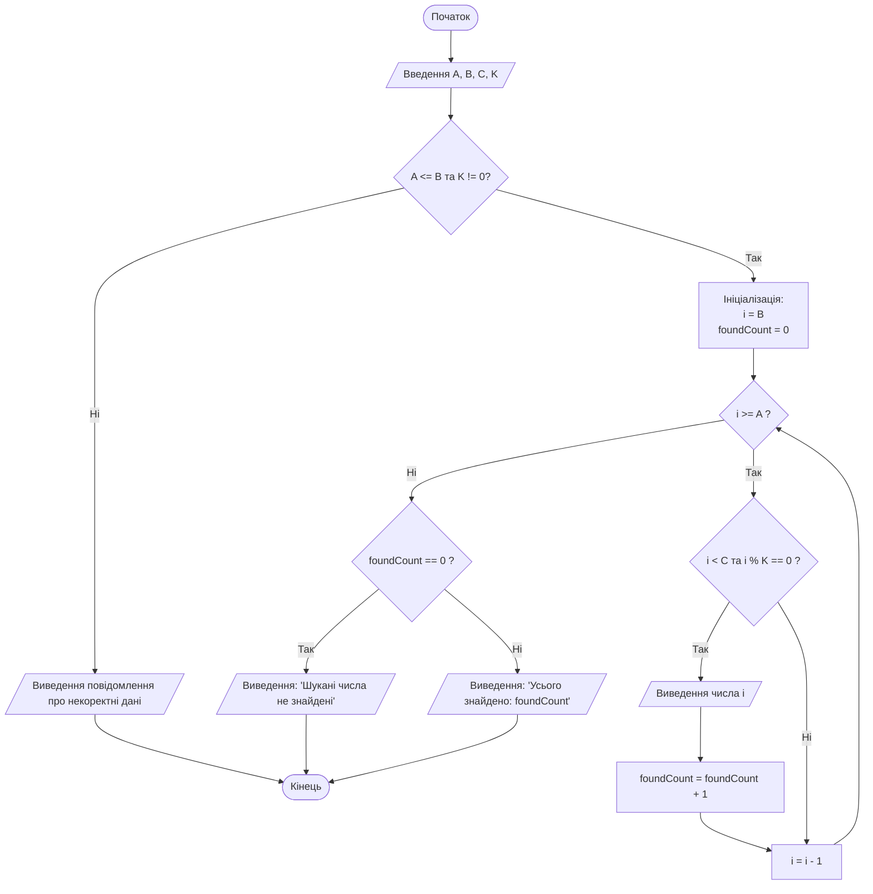
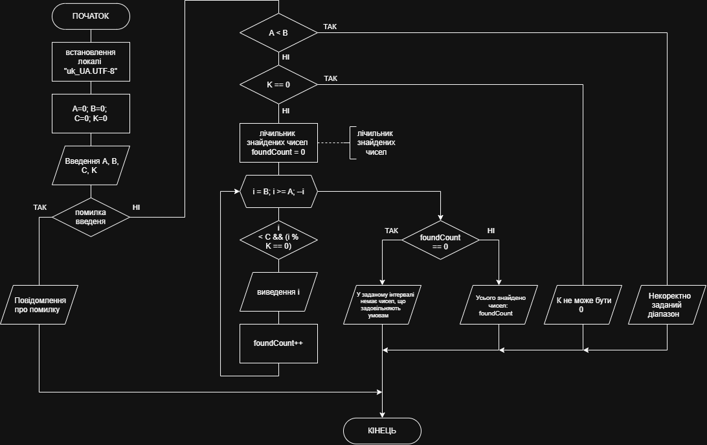

# Лабораторна робота №2. Програмування числових послідовностей та циклічних процесів

## Мета роботи

Ознайомлення з базовими алгоритмічними конструкціями повторення (циклами) у мові програмування С++; набуття практичних навичок по роботі з числовими послідовностями, побудови блок-схем алгоритмів з циклами та розгалуженнями, використання операторів циклу (`for`, `while`, `do .. while`), валідації вхідних даних та розробки комплексних тестових наборів.

---

## Задачі роботи

1. Дослідити синтаксис та принципи функціонування циклічних операторів `for`, `while` та `do .. while` у C++.
2. Навчитися реалізовувати ітеративні перебори діапазонів цілих чисел у прямому та зворотному напрямках із заданим або змінним кроком.
3. Опанувати накладання базових умов фільтрації (перевірка на кратність за допомогою оператора залишку від ділення `%`, порівняння з межами та граничними константами).
4. Забезпечити коректну обробку крайових ситуацій:
   - відсутність чисел, що задовольняють критеріям фільтрації;
   - некоректний ввід меж інтервалу (наприклад, $A > B$);
   - ділення на нуль при перевірці кратності (дільник дорівнює нулю).
5. Побудувати графічну схему алгоритму (draw.io, Visio, Mermaid).
6. Провести тестування програми на щонайменше 5 різнопланових тестових наборах (включаючи типові, межові та виняткові випадки).

## Перелік індивідуальних варіантів завдання

> *Примітка: якщо в інтервалі не знайдено жодного числа, яке задовольняє умову задачі, програма повинна виводити відповідне інформативне повідомлення.*

| № | Індивідуальне завдання |
| ---: | --- |
| 1 | Вивести усі парні числа в інтервалі від $A$ до $B$. $A$ та $B$ — цілі додатні числа, які визначає користувач. |
| 2 | Вивести всі непарні числа в інтервалі від $A$ до $B$. $A$ та $B$ — цілі додатні числа, які визначає користувач. |
| 3 | Користувач вводить три цілих числа $A$, $B$ і $C$. Вивести всі числа з інтервалу від $A$ до $B$, які більші за $C$. |
| 4 | Користувач вводить три цілих числа $A$, $B$ та $C$. Вивести всі числа з інтервалу від $A$ до $B$, які кратні $C$. |
| 5 | Вивести всі цілі числа з інтервалу від $A$ до $B$, кратні 10. $A$ та $B$ — дійсні числа, значення яких вводить користувач. |
| 6 | Користувач вводить три цілих від’ємних числа $A$, $B$ і $C$. Вивести у зворотному порядку всі числа з інтервалу від $A$ до $B$, які менші за $C$. $A < B$. |
| 7 | Користувач вводить чотири цілі додатні числа $A$, $B$, $C$ і $D$. Вивести всі числа з інтервалу від $A$ до $B$, які більші за $C$ і кратні $D$. |
| 8 | Вивести у зворотному порядку всі числа з інтервалу $[-90, 0]$, які кратні деякому числу $X$, що вводиться користувачем. |
| 9 | Користувач вводить чотири цілі додатні числа $A$, $B$, $C$ і $D$. Вивести у зворотному порядку всі числа з інтервалу від $A$ до $B$, які кратні $C$ і кратні $D$. |
| 10 | Користувач вводить чотири цілих числа $A$, $B$, $C$ та $D$, причому $A$, $B$ і $C$ — від’ємні. Вивести всі числа з інтервалу від $A$ до $B$ ($A < B$), які більші за $C$ і кратні $D$. Якщо таких чисел немає, вивести відповідне повідомлення. |

---

## Приклад виконання завдання

### 1. Умова завдання

Користувач вводить чотири цілих числа $A$, $B$, $C$ та $K$ ($A < B$). Знайти та вивести на екран у **зворотному порядку** (від більшого до меншого) всі цілі числа з інтервалу $[A, B]$, які одночасно задовольняють дві умови:

1. число строго менше за константу $C$
2. число ділиться націло (кратне) на $K$

Якщо в заданому інтервалі немає жодного числа, яке відповідає зазначеним критеріям, або якщо користувач ввів некоректний дільник чи межі інтервалу — повідомити про це користувача відповідним повідомленням.

---

### 2. Аналіз умови та теоретичні відомості

1. **Інтервал значень та напрям ітерації:**
   Інтервал $[A, B]$ при $A \le B$ включає цілі числа від $A$ до $B$. Оскільки умова вимагає виведення результатів у **зворотному порядку**, лічильник циклу $i$ повинен починатися зі значення верхньої межі $B$ та зменшуватись (`i--`) до значення нижньої межі $A$ включно ($i \ge A$).
2. **Перевірка кратності в C++:**
   Операція перевірки ділення націло цілого числа $x$ на число $k$ реалізується за допомогою оператора залишку від цілочисельного ділення `%`:
   $$x \pmod k == 0 \iff x \% k == 0$$
   *Важливе зауваження щодо безпеки:* Якщо $k = 0$, операція `x % k` призводить до невизначеної поведінки (апаратний виняток ділення на нуль — `ArithmeticException` / `SIGFPE`). Необхідно обов'язково валідувати, що $K \neq 0$.
3. **Облік знайдених елементів (прапорець / лічильник):**
   Щоб визначити, чи було знайдено хоча б одне число, використовується змінна-лічильник `foundCount` або логічний прапорець `bool found = false;`. Якщо після завершення циклу лічильник дорівнює нулю (або прапорець дорівнює `false`), програма виводить спеціальне повідомлення про відсутність шуканих елементів.
4. **Валідація вхідних даних:**
   Перед початком ітерацій слід перевірити коректність введених користувачем даних:
   - Якщо $A > B$, користувачу пропонується повторити введення або автоматично виконати нормалізацію (swap). У строгій постановці завдання повідомимо про помилку діапазону.
   - Якщо $K = 0$, виводиться повідомлення про неможливість ділення на нуль.
   - Якщо $K > B$, виводиться повідомлення про занадто велике значення (жодне число з діапазону не може ділитись націло на $K$)

---

### 3. Схема алгоритму програми (Mermaid)

Схема алгоритму, виконана за допомогою мови розмітки mermaid:



Схема алгоритму, виконана за допомогою ресурсу draw.io:


### 4. Програма на C++

Повна програма, що реалізує завдання.

```cpp
#include <iostream>
#include <locale>

int main() {
    // Налаштування виведення українських символів у консолі (за потреби для Windows)
    //std::setlocale(LC_ALL, "Ukrainian");
    std::setlocale(LC_ALL, "uk_UA.UTF-8");
    

    std::cout << "========================================================\n";
    std::cout << " Лабораторна робота №2. Приклад розв'язання задачі\n";
    std::cout << " Числа з [A, B], менші за C та кратні K (зворотний порядок)\n";
    std::cout << "========================================================\n\n";

    long long A = 0, B = 0, C = 0, K = 0;

    std::cout << "Введіть нижню межу інтервалу (A): ";
    if (!(std::cin >> A)) {
        std::cerr << "Помилка введення: введено неціле значення!\n";
        return 1;
    }

    std::cout << "Введіть верхню межу інтервалу (B): ";
    if (!(std::cin >> B)) {
        std::cerr << "Помилка введення: введено неціле значення!\n";
        return 1;
    }

    std::cout << "Введіть граничне значення (C): ";
    if (!(std::cin >> C)) {
        std::cerr << "Помилка введення: введено неціле значення!\n";
        return 1;
    }

    std::cout << "Введіть дільник (K, не 0): ";
    if (!(std::cin >> K)) {
        std::cerr << "Помилка введення: введено неціле значення!\n";
        return 1;
    }

    // Перевірка коректності вхідних параметрів
    if (A > B) {
        std::cout << "\nПомилка: Нижня межа A (" << A 
                  << ") не може перевищувати верхню межу B (" << B << ")!\n";
        return 1;
    }

    if (K == 0) {
        std::cout << "\nПомилка: Дільник K не може дорівнювати 0 (ділення на нуль)!\n";
        return 1;
    }

    std::cout << "\n--- Результати обробки числових даних ---\n";
    std::cout << "Числа з [" << A << ", " << B << "], які менші за " 
              << C << " та кратні " << K << " (у зворотному порядку):\n";

    int foundCount = 0;

    // Цикл у зворотному порядку: від B до A
    for (long long i = B; i >= A; --i) {
        // Перевірка умови: менше за C та кратне K
        if (i < C && (i % K == 0)) {
            std::cout << i << " ";
            foundCount++;
        }
    }

    // Перевірка, чи було знайдено хоча б одне число
    if (foundCount == 0) {
        std::cout << "У заданому інтервалі немає чисел, які б задовольняли вказаним умовам.\n";
    } else {
        std::cout << "\n\nУсього знайдено чисел: " << foundCount << "\n";
    }

    std::cout << "========================================================\n";
    return 0;
}
```

### 5. Пояснення принципів роботи програми

1. Змінні програми: Змінні `A`, `B`, `C` та `K` оголошено як `long long`, що гарантує захист від переповнення при роботі з широким діапазоном цілих чисел.
2. Контроль потоку введення: Оператори `if (!(std::cin >> ...))` захищають програму від некоректного введення користувачем нечислових символів (наприклад, літер або спеціальних знаків).
3. Логічний фільтр: Умовний вираз `if (i < C && (i % K == 0))` використовує операцію логічного «І» (`&&`), яка має скорочене обчислення (short-circuit evaluation).
4. Організація зворотного перебору: Застосовано оператор циклу `for (long long i = B; i >= A; --i)`. Стартове значення встановлюється в `B`, кожна ітерація зменшує поточне значення на одиницю, а зупинка циклу відбувається, коли `i` стає меншим за `A`.
5. Інформативність: Після завершення циклу виконується аналіз значення змінної `foundCount`. Якщо лічильник дорівнює 0, користувач бачить зрозуміле повідомлення замість пустого екрана консолі.

### 6. Приклад роботи програми в консолі

```cmd
========================================================
 Лабораторна робота №2. Приклад розв'язання задачі
 Числа з [A, B], менші за C та кратні K (зворотний порядок)
========================================================

Введіть нижню межу інтервалу (A): -20
Введіть верхню межу інтервалу (B): 30
Введіть граничне значення (C): 15
Введіть дільник (K, не 0): 5

--- Результати обробки числових даних ---
Числа з [-20, 30], які менші за 15 та кратні 5 (у зворотному порядку):
10 5 0 -5 -10 -15 -20 

Усього знайдено чисел: 7
========================================================
```

### 6. Тестування програми

Після написання програми її необхідно перевірити на декількох наборах вхідних даних. Для кожної лабораторної роботи рекомендується підготувати **5–7 тестових випадків**. Тестування повинно включати не тільки звичайні очікувані дані, а й спеціальні випадки.

Типи тестових випадків

| № тесту | Тип тесту | Вхідні дані ($A, B, C, K$) | Очікуваний результат | Мета перевірки |
| :---: | :--- | :--- | :--- | :--- |
| **Тест 1** | Нормальний (типовий випадок) | `A = 1`, `B = 25`, `C = 20`, `K = 3` | `18 15 12 9 6 3`<br> (Усього: 6) | Перевірка зворотного виведення та одночасної кратності й обмеження зверху для додатних чисел. |
| **Тест 2** | Робота з від'ємними числами та 0 | `A = -15`, `B = 5`, `C = 2`, `K = 4` | `0 -4 -8 -12`<br>(Усього: 4) | Перевірка коректності обчислення залишку `%` для 0 та від'ємних значень, спадний порядок. |
| **Тест 3** | Відсутність відповідних елементів | `A = 10`, `B = 20`, `C = 5`, `K = 2` | `У заданому інтервалі немає чисел, які б задовольняли вказаним умовам.` | Перевірка умови, коли жоден елемент не задовольняє критерію $i < C$ (бо мінімум $A=10 > C=5$). |
| **Тест 4** | Крайові умови (всі числа кратні) | `A = 6`, `B = 6`, `C = 10`, `K = 3` | `6`<br>(Усього: 1) | Перевірка граничного випадку одномісного інтервалу $[A, B]$, коли $A = B$. |
| **Тест 5** | Виняткова ситуація (ділення на 0) | `A = 1`, `B = 50`, `C = 30`, `K = 0` | Повідомлення про помилку:<br>`Помилка: Дільник K не може дорівнювати 0 (ділення на нуль)!` | Перевірка системи валідації вхідних параметрів та запобігання аварійному збою (Crash / SIGFPE). |

## Вимоги до звіту

За результатами виконання індивідуального варіанта завдання треба підготувати звіт, складений за встановленим шаблоном.

**Структура звіту:**

1. Титульний аркуш із зазначенням назви дисципліни, номера лабораторної роботи та її теми, навчальної групи та ПІБ студента.
2. Текст завдання відповідно до призначеного індивідуального варіанта (з точним описом умов та обмежень).
3. Теоретичні відомості та опис способу вирішення завдання:
    - математичні формули, визначення, позначення;
    - обґрунтування вибору конкретного циклічного оператора (for, while, do-while);
    - опис алгоритму перевірки кратності, фільтрації та формування виводу.
4. Схема алгоритму програми, оформлена відповідно до стандартів (блок-схема) у графічному вигляді, або згенерована за допомогою мови опису діаграм Mermaid (код, що описує діаграму, теж треба додати у звіт).
5. Текст програми (лістинг коду). Обов'язкове оформлення моноширинним шрифтом (Courier New, Consolas, Lucida Console тощо). Наявність коментарів у ключових блоках коду (ініціалізація, цикл, логічні перевірки).
6. Перелік тестових випадків та результати їх виконання:
    - таблиця тестових наборів (не менше 5 варіантів, включаючи типові, межові та помилкові дані);
    - копії (знімки екрана / скріншоти) вікна командного рядка з реальними результатами запуску програми для кожного тесту.
7. Висновки (бажано), підсумок щодо досягнення мети роботи, особливості функціонування розробленої програми, виявлені обмеження або потенційні шляхи покращення.
