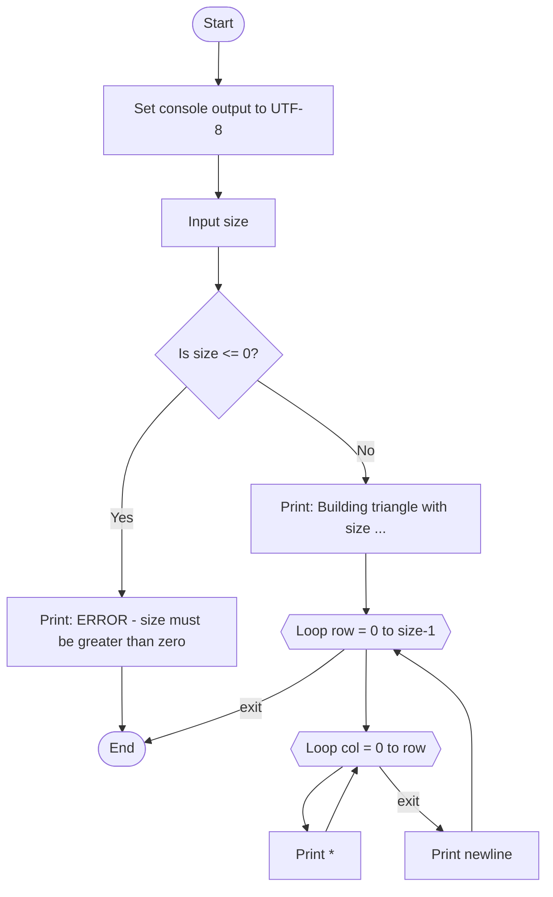

# LAB 03

Схема алгоритму, що описує роботу програми для лабораторної роботи 03

```mermaid
flowchart TD
    A([Start]) --> B[Set console output to UTF-8]
    B --> C[Input size]
    C --> D{Is size <= 0?}
    
    D -- Yes --> E[Print: ERROR - size must be greater than zero]
    E --> F([End])
    
    D -- No --> G[Print: Building triangle with size ...]
    G --> H{{Loop row = 0 to size-1}}
    
    H --> I{{Loop col = 0 to row}}
    I --> J[Print *]
    J --> I
    I -- exit --> K[Print newline]
    K --> H
    H -- exit --> F([End])
```
