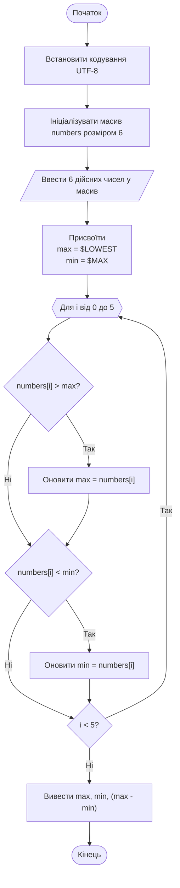

# Приклад програми для завдання ЛР04

## Завдання

Написати код програми на мові C++ для виконання наступного завдання: ввести 6 дійсних чисел та віднайти максимальний і мінімальний елементи та визначити наскільки максимальний елемент є більшим за мінімальний

## Код програми

Ось код програми на мові C++, який виконує поставлене завдання:

```cpp
#include <iostream>
#include <limits>
#include <windows.h> // для SetConsoleOutputCP

using namespace std;

int main() {
    // Перемикаємо консоль у UTF-8
    SetConsoleOutputCP(CP_UTF8);
    
    const int size = 6;
    double numbers[size];
    
    // Введення 6 дійсних чисел
    cout << "Введіть 6 дійсних чисел:\n";
    for (int i = 0; i < size; ++i) {
        cin >> numbers[i];
    }

    // Ініціалізація максимального і мінімального значення
    double max = numeric_limits<double>::lowest();
    double min = numeric_limits<double>::max();

    // Знаходження максимального і мінімального елементів
    for (int i = 0; i < size; ++i) {
        if (numbers[i] > max) {
            max = numbers[i];
        }
        if (numbers[i] < min) {
            min = numbers[i];
        }
    }

    // Виведення результатів
    cout << "Максимальний елемент: " << max << endl;
    cout << "Мінімальний елемент: " << min << endl;
    cout << "Максимальний елемент більший за мінімальний на: " << (max - min) << endl;

    return 0;
}
```

## Пояснення коду програми

1. **Введення чисел**: Програма запитує у користувача ввести 6 дійсних чисел.
2. **Ініціалізація**: Використовуються `numeric_limits` для ініціалізації максимально можливого і мінімально можливого значень змінних `max` та `min`.
3. **Знаходження максимального і мінімального значень у масиві**: Програма проходить через масив чисел, щоб знайти максимальне і мінімальне значення.
4. **Виведення результатів**: Виводяться максимальний і мінімальний елементи, а також різниця між ними.

## Схема алгоритму програми

Схема алгоритму роботи програми за поставленим завданням:


