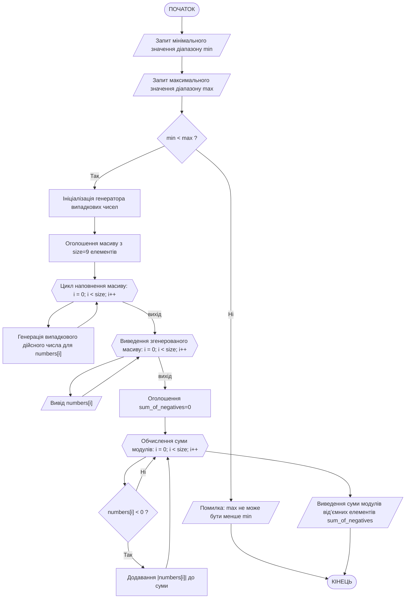
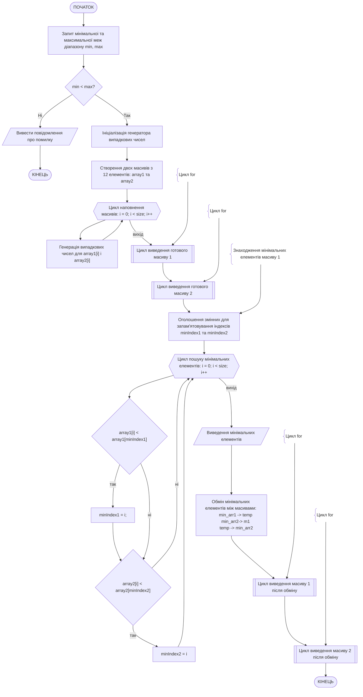

# Способи отримання випадкових цілих та дійсних чисел у мові C++

У мові C++ є кілька способів генерування випадкових чисел. Залежно від стандарту мови, який використовується, а також в залежності від умов та складності поставленої задачі, можна використати спрощений класичний спосіб (C-style, `<cstdlib>`), або сучасний, більш надійний спосіб (введено у стандарті C++11, бібліотека `<random>`).

## Класичний спосіб

Використовуються функції `rand()` і `srand()` з бібліотеки `<cstdlib>`. Приклад програми, що використовує цей спосіб:

```cpp
#include <iostream>
#include <cstdlib>  // rand, srand
#include <ctime>    // time

using namespace std;

int main() {
    // ініціалізація генератора псевдовипадкових чисел
    srand(time(nullptr)); 

    // Випадкове ціле число від 0 до RAND_MAX
    int r1 = rand();

    // Випадкове ціле число від 1 до 100
    int r2 = rand() % 100 + 1;

    // Випадкове дійсне число від 0 до 1
    double r3 = (double)rand() / RAND_MAX;

    // Випадкове дійсне число від -20 до 20
    double r4 = ((double)rand() / RAND_MAX);

    cout << "rand() = " << r1 << endl;
    cout << "Від 1 до 100: " << r2 << endl;
    cout << "Дійсне [0..1]: " << r3 << endl;
    cout << "Дійсне [-20..20]: " << r4 << endl;
}
```

Основними слабкими сторонами цього способу є низька якість випадковості та однаковий діапазон для всіх типів чисел. Якщо необхідно згенерувати числа для чогось простого, наприклад вирішення навчального завдання — цей метод цілком підійде. Але якщо треба вирішити серйозну практичну задачу, де необхідна генерація випадкових чисел: симуляції фізичних процесів, наукові розрахунки, ігрова індустрія — краще використовувати більш сучасний спобіб з використанням можливостей спеціальної бібілотеки `<random>`.

## Сучасний спосіб

У C++ для генерації випадкових чисел можна використовувати бібліотеку `<random>`, яка надає потужні інструменти для роботи з випадковими числами. Ось як можна отримати випадкові цілі та дійсні числа в заданих діапазонах.

## Випадкові цілі числа

Для генерації випадкових цілих чисел у вказаному діапазоні, наприклад, від `min` до `max`, можна використовувати `uniform_int_distribution`. Ось приклад:

### Приклад 1: генерація випадкових цілих чисел

```cpp
#include <iostream>
#include <random>

using namespace std;

int main() {
    // Ініціалізація генератора випадкових чисел
    random_device rd;  // Отримуємо випадкове число з апаратного генератора
    mt19937 gen(rd());  // Створюємо генератор на основі випадкового числа

    // Визначення діапазону
    int min = 1;
    int max = 100;

    // Створення розподілу
    uniform_int_distribution<> dis(min, max);

    // Генерація і виведення випадкового цілого числа
    int random_integer = dis(gen);
    cout << "Випадкове ціле число: " << random_integer << endl;

    return 0;
}
```

### Пояснення та коментарі до прикладу 1

1. **`random_device`**: клас, який забезпечує доступ до апаратного генератора випадкових чисел (якщо він доступний на платформі). Він використовується для отримання початкового випадкового значення (seed) для  ініціалізації генератора псевдовипадкових чисел
2. **`mt19937`**: реалізація генератора Mersenne Twister, який є достатньо швидким і має хороші статистичні властивості. Ініціалізується значенням, отриманим від `random_device` (тобто `rd()`), і вже в подальшому використовується для генерації послідовності псевдовипадкових чисел
3. **`uniform_int_distribution`**: клас, який забезпечує рівномірний розподіл випадкових цілих чисел у заданому діапазоні [min, max]. Використовується для перетворення псевдовипадкових чисел, згенерованих генератором (gen), у випадкові числа, які рівномірно розподілені в межах [min, max].

## Випадкові дійсні числа

Для генерації випадкових дійсних чисел у вказаному діапазоні, наприклад, від `min` до `max`, можна використовувати `uniform_real_distribution`. Ось приклад:

### Приклад 2: генерація випадкових дійсних чисел

```cpp
#include <iostream>
#include <random>

using namespace std;

int main() {
    // Ініціалізація генератора випадкових чисел
    random_device rd;  // Отримуємо випадкове число з апаратного генератора
    mt19937 gen(rd());  // Створюємо генератор на основі випадкового числа

    // Визначення діапазону
    double min = 1.0;
    double max = 100.0;

    // Створення розподілу
    uniform_real_distribution<> dis(min, max);

    // Генерація і виведення випадкового дійсного числа
    double random_real = dis(gen);
    cout << "Випадкове дійсне число: " << random_real << endl;

    return 0;
}
```

### Пояснення та коментарі до прикладу 2

Загальний механізм отримання дійсних чисел дуже схожий. Відмінність полягає лише у виборі іншого класу для створення розподілу та типу змінних для вказання діапазону.

1. **`uniform_real_distribution`**: Використовується для генерації випадкових дійсних чисел у заданому діапазоні. Вона забезпечує рівномірний розподіл значень.

## Завдання 1: обчислення суми модулів усіх від’ємних елементів масиву з дійсними числами

Завдання: створити програму на мові с++, в якій у користувача запитується діапазон чисел, на основі якого створюється масив з 9 елементів і наповнюється випадковими дійсними числами з заданого діапазону, згенерований масив виводиться. Потім на базі масиву виконується завдання: обчислити суму модулів усіх від’ємних елементів масиву.

### Програма, що реалізує завдання 1

```cpp
#include <iostream>
#include <random>
#include <cmath> // Для функції abs

using namespace std;

int main() {
    // Запит у користувача діапазону
    double min, max;
    cout << "Введіть мінімальне значення діапазону: ";
    cin >> min;
    cout << "Введіть максимальне значення діапазону: ";
    cin >> max;

    // Перевірка коректності діапазону
    if (min >= max) {
        cout << "Мінімальне значення повинно бути меншим за максимальне." << endl;
        return 1;
    }

    // Ініціалізація генератора випадкових чисел
    random_device rd;
    mt19937 gen(rd());
    uniform_real_distribution<> dis(min, max);

    // Створення масиву з 9 елементів
    const int size = 9;
    double numbers[size];

    // Наповнення масиву випадковими дійсними числами
    for (int i = 0; i < size; ++i) {
        numbers[i] = dis(gen);
    }

    // Виведення згенерованого масиву
    cout << "Згенерований масив: ";
    for (int i = 0; i < size; ++i) {
        cout << numbers[i] << " ";
    }
    cout << endl;

    // Обчислення суми модулів усіх від’ємних елементів
    double sum_of_negatives = 0.0;
    for (int i = 0; i < size; ++i) {
        if (numbers[i] < 0) {
            sum_of_negatives += abs(numbers[i]);
        }
    }

    // Виведення результату
    cout << "Сума модулів від’ємних елементів: " << sum_of_negatives << endl;

    return 0;
}
```

### Алгоритм програми завдання 1 у форматі mermaid

Схема алгоритму програми для завдання 1



## Завдання 2: обмін мінімальними елементами між двома масивами

Завдання: створити програму на мові с++, в якій у користувача запитується діапазон чисел, на основі якого створюються два масиви з 12 елементами і наповнюється випадковими дійсними числами з заданого діапазону, згенеровані масиви виводяться. Потім визначити мінімальні елементи кожного з них і поміняти їх місцями.

### Програма, що реалізує завдання 2

```cpp
#include <iostream>
#include <random>

using namespace std;

int main() {
    // Запит у користувача діапазону
    double min, max;
    cout << "Введіть мінімальне значення діапазону: ";
    cin >> min;
    cout << "Введіть максимальне значення діапазону: ";
    cin >> max;

    // Перевірка коректності діапазону
    if (min >= max) {
        cout << "Мінімальне значення повинно бути меншим за максимальне." << endl;
        return 1;
    }

    // Ініціалізація генератора випадкових чисел
    random_device rd;
    mt19937 gen(rd());
    uniform_real_distribution<> dis(min, max);

    // Створення двох масивів
    const int size = 12;
    double array1[size], array2[size];

    // Наповнення масивів випадковими дійсними числами
    for (int i = 0; i < size; ++i) {
        array1[i] = dis(gen);
        array2[i] = dis(gen);
    }

    // Виведення згенерованих масивів
    cout << "Масив 1: ";
    for (int i = 0; i < size; ++i) {
        cout << array1[i] << " ";
    }
    cout << endl;

    cout << "Масив 2: ";
    for (int i = 0; i < size; ++i) {
        cout << array2[i] << " ";
    }
    cout << endl;

    // Знаходження мінімальних елементів у кожному масиві
    int minIndex1 = 0, minIndex2 = 0;
    for (int i = 1; i < size; ++i) {
        if (array1[i] < array1[minIndex1]) {
            minIndex1 = i;
        }
        if (array2[i] < array2[minIndex2]) {
            minIndex2 = i;
        }
    }

    // Виведення мінімальних елементів
    cout << "Мінімальний елемент масиву 1: " << array1[minIndex1] << endl;
    cout << "Мінімальний елемент масиву 2: " << array2[minIndex2] << endl;

    // Обмін мінімальних елементів
    double temp = array1[minIndex1];
    array1[minIndex1] = array2[minIndex2];
    array2[minIndex2] = temp;

    // Виведення масивів після обміну
    cout << "Масив 1 після обміну: ";
    for (int i = 0; i < size; ++i) {
        cout << array1[i] << " ";
    }
    cout << endl;

    cout << "Масив 2 після обміну: ";
    for (int i = 0; i < size; ++i) {
        cout << array2[i] << " ";
    }
    cout << endl;

    return 0;
}
```

### Алгоритм програми завдання 2 у форматі mermaid

Схема алгоритму програми для завдання 2


