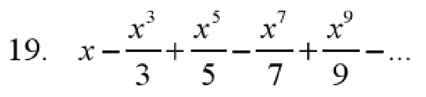
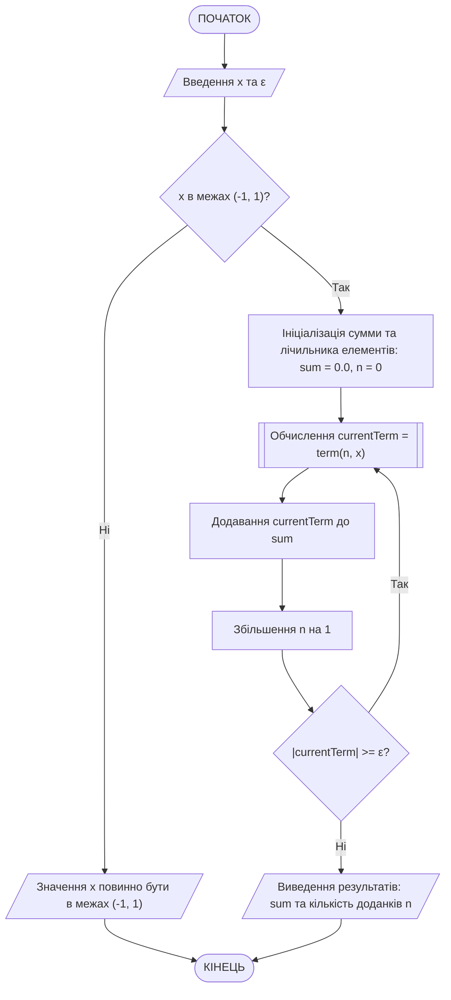
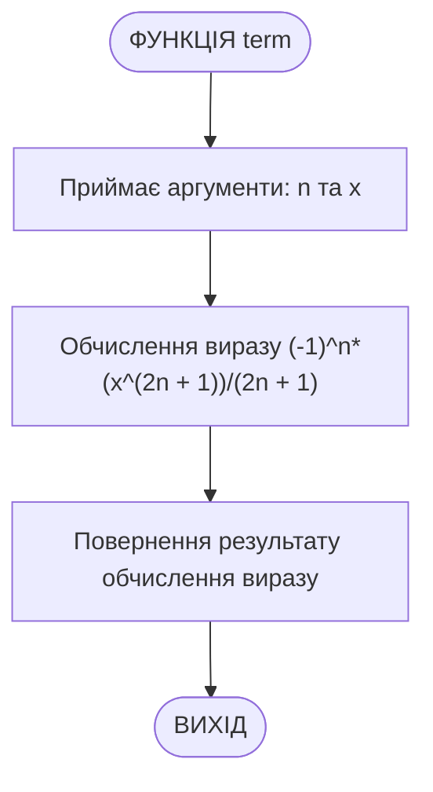

# Приклад виконання завдання ЛР06

## Текст завдання (варіант 19)

Написати програму на мові C++ для наступного завдання:

Обчислення cуми нескінченної числової послідовності. Ввести значення x на діапазоні (-1 < х < 1) та точність обчислення ε. Обчислити та вивести на екран суму визначеного індивідуальним варіантом ряду із заданою точністю ε. Визначити кількість доданків. Кожен член ряду обчислити як функцію. Послідовність задана формулою

$$x-\frac{x^3}{3}+\frac{x^5}{5}-\frac{x^7}{7}+\frac{x^9}{9}-\ldots$$



## Теоретичні відомості для виконання завдання

Розглянувши наявні елементи було визначено закономірність формування кожного наступного елементу, яку можна виразити формулою:

$$(-1)^n\cdot(\frac{x^{2n+1}}{2n+1})$$

Для виконання умови завдання цю формулу реалізовано у вигляді окремої підпрограми (функції).

Процес розрахунку суми відбувається ітеративно доти, доки різниця між попереднім та поточним значенням суми не стане меншою за визначену точність обчислення ε. Тобто при розрахунку кожного наступного елементу послідовності слід порівнювати значення поточного розрахованого елементу з значенням точності. Коли значення елементу стане меншим за точність, можна припинити обчислення суми послідовності.

## Програма, що виконує завдання

Ось програма на C++, яка обчислює суму нескінченної числової послідовності, заданої формулою, з урахуванням точності ε. Кожен член ряду обчислюється як функція.

```cpp
#include <iostream>
#include <cmath>

using namespace std;

// Функція для обчислення n-го члена ряду
double term(int n, double x) {
    return pow(-1, n)*(pow(x, 2 * n + 1)) / (2 * n + 1);
}

int main() {
    double x, epsilon;
    cout << "Введіть x (-1 < x < 1): ";
    cin >> x;
    cout << "Введіть точність ε: ";
    cin >> epsilon;
    epsilon = fabs(epsilon);

    // Перевірка на допустимість x
    if (x <= -1 || x >= 1) {
        cout << "Значення x повинно бути в межах (-1, 1)." << endl;
        return 1;
    }

    double sum = 0.0;
    double currentTerm;
    int n = 0;

    // Обчислення суми ряду
    do {
        currentTerm = term(n, x);
        sum += currentTerm;
        n++;
    } while (fabs(currentTerm) >= epsilon);

    cout << "Сума ряду: " << sum << endl;
    cout << "Кількість доданків: " << n << endl;

    return 0;
}
```

### Пояснення принципів роботи програми

1. **Функція term**: Обчислює n-й член ряду за формулою $(\frac{x^{2n+1}}{2n+1})$.
2. **Основна функція main**:
   - Запитує у користувача значення x та точність ε.
   - Перевіряє, чи входить x в допустимий діапазон (-1, 1).
   - Використовує цикл do-while для обчислення суми ряду, поки абсолютне значення поточного члена ряду більше або дорівнює ε.
   - Виводить отриману суму та кількість доданків.

### Схема алгоритму програми

Схема алгоритму основної програми main() (main.cpp):



Схема алгоритму підпрограми term() (main.cpp):


