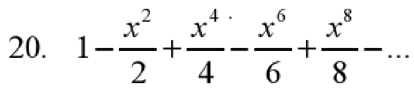
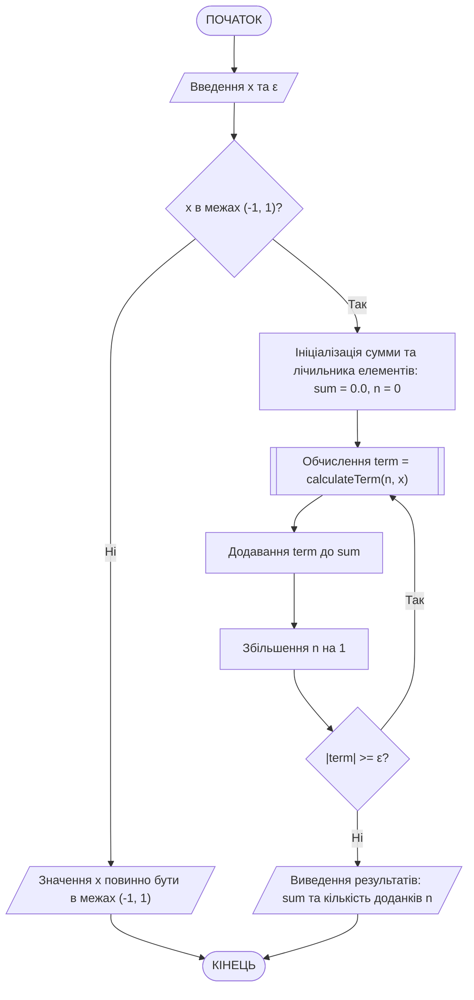
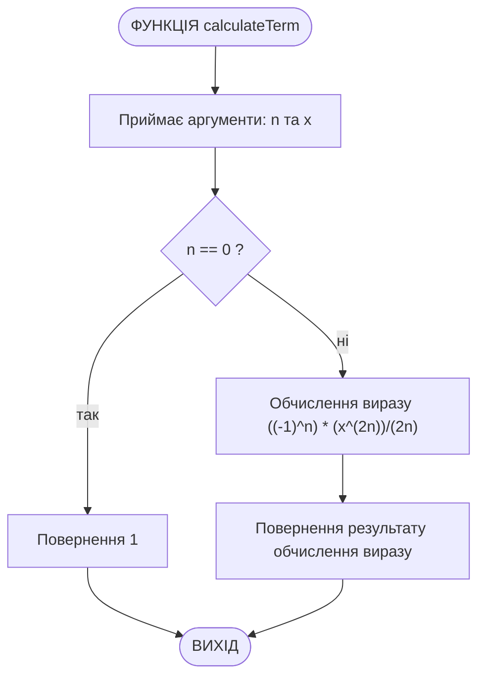

# Приклад виконання завдання ЛР06

## Текст завдання (варіант 20)

Написати програму на с++ для наступного завдання:

Обчислення суми нескінченної числової послідовності. Ввести x на діапазоні (-1 < х < 1) та точність обчислення ε. Обчислити та вивести на екран суму ряду із заданою точністю ε. Визначити кількість доданків. Кожен член ряду обчислити як функцію. Послідовність задана формулою



## Теоретичні відомості для виконання завдання

Розглянувши наявні елементи було визначено закономірність формування кожного наступного елементу, яку можна виразити формулою:

$$(-1)^n\cdot\frac{x^{2n}}{2n};\; n\in[0, 1, 2, ...]$$

Але слід відмітити, що перший елемент послідовності не може бути згенерований за допомогою наведеної формули: при $n=0$ відбувається ділення на 0. Тому при реалізації обчислення елементів послідовності слід врахувати цю особливість. Для виконання умови завдання наведену формулу реалізовано у вигляді окремої підпрограми (функції).

Процес розрахунку суми відбувається ітеративно доти, доки різниця між попереднім та поточним значенням суми не стане меншою за визначену точність обчислення ε. Тобто при розрахунку кожного наступного елементу послідовності слід порівнювати значення поточного розрахованого елементу з значенням точності. Коли значення елементу стане меншим за точність, можна припинити обчислення суми послідовності.

## Програма, що виконує завдання

Ось програма на C++, яка обчислює суму нескінченної числової послідовності за заданою формулою. Програма запитує у користувача значення  $x$ та точність $\varepsilon$, а потім обчислює суму ряду, виводячи результат на екран разом із кількістю доданків.

```cpp
#include <iostream>
#include <cmath>

using namespace std;

// Функція для обчислення n-го члена ряду
double calculateTerm(int n, double x) {
    if (n == 0)
        return 1;
    else
        return (pow(-1, n) * pow(x, 2*n)) / (n * 2);
}

int main() {
    double x, epsilon;
    cout << "Введіть x (-1 < x < 1): ";
    cin >> x;
    cout << "Введіть точність ε: ";
    cin >> epsilon;

    // Перевірка на правильність введення x
    if (x <= -1 || x >= 1) {
        cout << "Значення x повинно бути в межах (-1, 1)." << endl;
        return 1;
    }

    double sum = 0.0;
    double term;
    int n = 0;
    int count = 0;

    // Обчислення суми ряду
    do {
        term = calculateTerm(n, x);
        sum += term;
        count++;
        n++;
    } while (fabs(term) >= epsilon); // Продовжувати, поки член ряду більший за ε

    // Виведення результатів
    cout << "Сума ряду: " << sum << endl;
    cout << "Кількість доданків: " << count << endl;

    return 0;
}
```

### Пояснення принципів роботи програми

1. **Функція calculateTerm**: Обчислює n-й член ряду за формулою $(-1)^n\cdot\frac{x^{2n}}{2n};\; n\in[1, 2, ...]$. У випадку, коли $n=0$, функція повертає 1 (обчислення першого елементу послідовності є неможливим, оскільки виходить ділення на 0).

2. **Основна функція main**:
   - Запитує у користувача значення x та точність $\varepsilon$.
   - Перевіряє, чи входить x в допустимі межі (-1, 1).
   - Використовує цикл do-while для обчислення суми ряду, поки абсолютне значення члена ряду більше або дорівнює $\varepsilon$.
   - Виводить отриману суму та кількість доданків.

### Схема алгоритму програми

Схема алгоритму основної програми main() (main.cpp):



Схема алгоритму підпрограми calculateTerm() (main.cpp):


