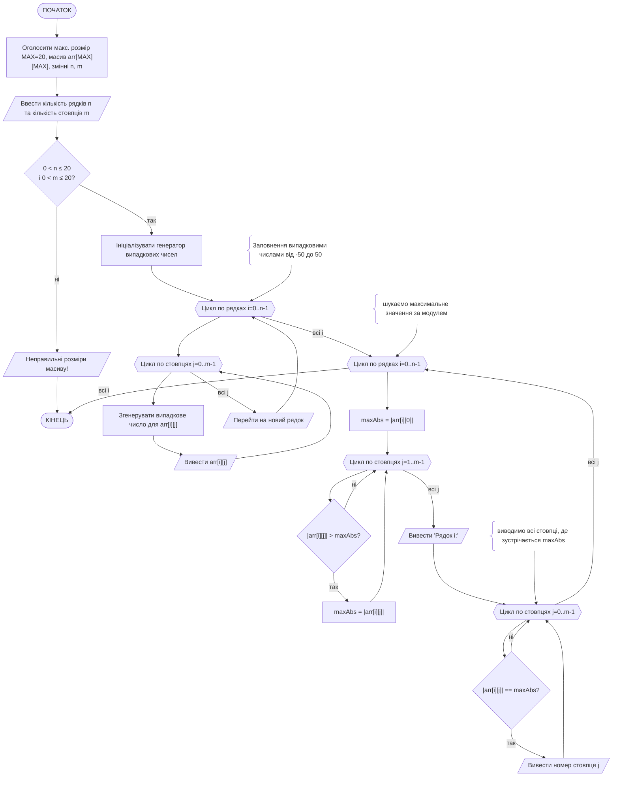

# Приклад виконання завдання ЛР07

## Текст завдання (варіант 19)

Написати програму на мові с++, яка виконує наступне завдання: ввести масив, який містить не більше 20х20 елементів дійсного типу (можна створити масив з використанням генератора випадкових чисел). Для кожного його рядка обчислити та вивести на екран номери стовбців максимального за модулем елемента.

## Теоретичні відомості для виконання завдання

Для полегшення роботи з програмою масив дійсних чисел заповнюється автоматизованим способом: за допомогою генератора псевдовипадкових чисел (ГПВЧ). Параметри ГПВЧ можуть задаватись користувачем, або можуть бути зафіксовані у програмі, наприклад, дійсні числа у діапазоні [-50; 50] з дробовою частиною не більш ніж 2 знаки після коми. Такі умови генерації можуть бути виконані за допомогою виразу:

```cpp
// зпочатку генерація цілої частини на діапазоні [0; 100], 
// зі зміщенням на 50 в бік від'ємних чисел
// до неї додається десятковий дріб з 2 знаками після коми
rand_var = (rand() % 101 - 50) + (rand() % 100) / 100.0;
```

 Для масиву встановлено максимальну розмірність 20х20, проте користувачу надається можливість вказувати довільний розмір в межах цієї розмірності. Для роботи програми можна створити фіксований масив з максимальною розмірністю, у якому буде використовуватись частина, розмірність якої буде задаватись користувачем. Для безпечного виконання програми введені користувачем значення розмірності перевіряються на відповідність вимогам.

Основна частина завдання виконується так:

1) організується цикл обходу по рядках масиву (перший вимір)
2) спочатку виконується обхід по усіх елементах рядка, для того, аби знайти та запам'ятати максимальний за модулем елемент (його значення)
3) виконується другий обхід по елементах поточного рядку, для того, аби вивести на екран ідекси тих позицій, де знаходиться максимальний за модулем елемент (може бути не одна позиція)

## Програма, що виконує завдання

Ось програма на мові C++, яка виконує поставлене завдання. Вона генерує масив розміром до 20x20 (розміри задає користувач) з випадковими дійсними числами (в діапазоні від -50 до 50), а потім для кожного рядка знаходить та виводить номери стовпців максимального за модулем елемента.

```cpp
#include <iostream>
#include <cstdlib>  // для rand(), srand()
#include <ctime>    // для time()
#include <cmath>    // для fabs()

using namespace std;

int main() {
    const int MAX = 20;
    int n, m;

    cout << "Введіть кількість рядків (не більше 20): ";
    cin >> n;
    cout << "Введіть кількість стовпців (не більше 20): ";
    cin >> m;

    if (n > MAX || m > MAX || n <= 0 || m <= 0) {
        cout << "Неправильні розміри масиву!" << endl;
        return 1;
    }

    double arr[MAX][MAX];

    // ініціалізація генератора випадкових чисел
    srand(time(0));

    cout << "\nМасив (" << n << "x" << m << "):\n";

    // Заповнення випадковими числами від -50 до 50
    for (int i = 0; i < n; i++) {
        for (int j = 0; j < m; j++) {
            // генерація значення елемента масиву
            arr[i][j] = (rand() % 101 - 50) + (rand() % 100) / 100.0; 
            // вивід елемента масиву
            cout << arr[i][j] << "\t"; 
        }
        cout << endl;
    }

    cout << "\nНомери стовпців максимальних за модулем елементів у рядках:\n";

    // Обробка рядків
    for (int i = 0; i < n; i++) {
        // шукаємо максимальне значення за модулем
        double maxAbs = fabs(arr[i][0]);
        for (int j = 1; j < m; j++) {
            if (fabs(arr[i][j]) > maxAbs) {
                maxAbs = fabs(arr[i][j]);
            }
        }

        // виводимо всі стовпці, де зустрічається maxAbs
        cout << "Рядок " << i << ": ";
        for (int j = 0; j < m; j++) {
            if (fabs(arr[i][j]) == maxAbs) {
                cout << j << " ";
            }
        }
        cout << endl;
    }

    return 0;
}
```

### Приклад роботи програми

Приклад роботи програми для n=4 та m=5:

```bash
Матриця (4x5):
-6.4    -3.8     9.7     2.2     -9.7
 1.3     7.5    -7.5     0.4      2.1
-5.9     8.9    -2.3    -8.9      4.6
 0.5    -3.2     1.7    -6.8      6.8

Номери стовпців максимальних за модулем елементів у рядках:
Рядок 0: 2 4
Рядок 1: 1 2
Рядок 2: 1 3
Рядок 3: 3 4
```

## Детальний опис роботи наведеної програми

1. Оголошення розмірів масиву
    - Використовується статичний двовимірний масив `arr[20][20]` для збереження дійсних чисел.
    - Користувач вводить кількість рядків n та кількість стовпців m (не більше 20).
    - Якщо введено некоректні розміри (≤0 або >20) – програма завершується.
2. Заповнення масиву
    - Масив заповнюється випадковими числами від -50.00 до +50.99 (з точністю до десятих або сотих).
    - Для генерації випадкових чисел використовується `rand()` та початкове значення від `srand(time(0))`.
    - Одразу після генерації елементи масиву виводяться у вигляді матриці.
3. Обчислення максимальних за модулем елементів у рядках
    - Для кожного рядка знаходиться максимальне значення за модулем.
    - Використовується функція `fabs()`, щоб працювати з абсолютними значеннями.
    - Спочатку вважається, що максимумом є перший елемент рядка.
    - Далі здійснюється послідовне порівняння з іншими елементами.
4. Визначення стовпців, де знаходяться максимуми
    - Після знаходження найбільшого за модулем значення в рядку програма повторно проходить по рядку і виводить усі індекси стовпців, де зустрічається це значення.
    - Таким чином, якщо у рядку є кілька елементів з однаковим значенням за модулем, вони всі будуть враховані.
5. Вивід результатів
    - Для кожного рядка виводиться його номер (Рядок i:) та номери стовпців, у яких знаходяться максимальні за модулем елементи.

Підсумок
Програма дозволяє:
сформувати або перевірити матрицю дійсних чисел розміром до 20×20;
для кожного рядка визначити максимальні за модулем значення;
знайти всі стовпці, де ці значення зустрічаються, і вивести їх номери.

## Схема алгоритму роботи програми


