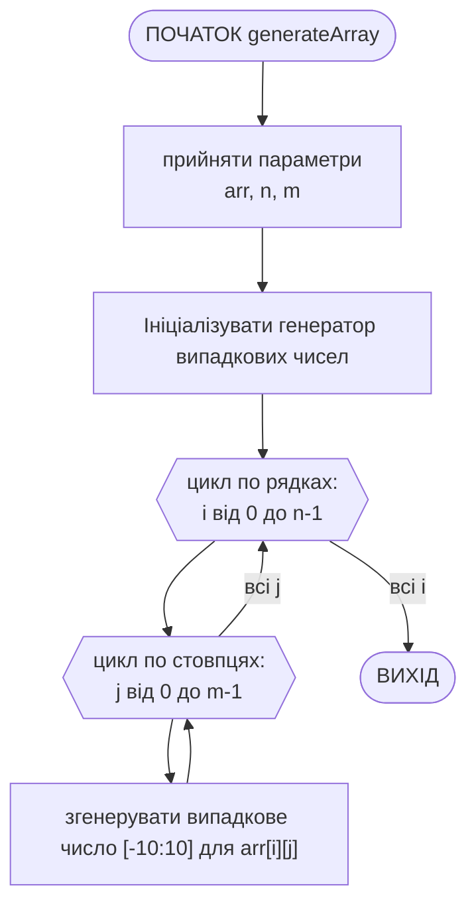
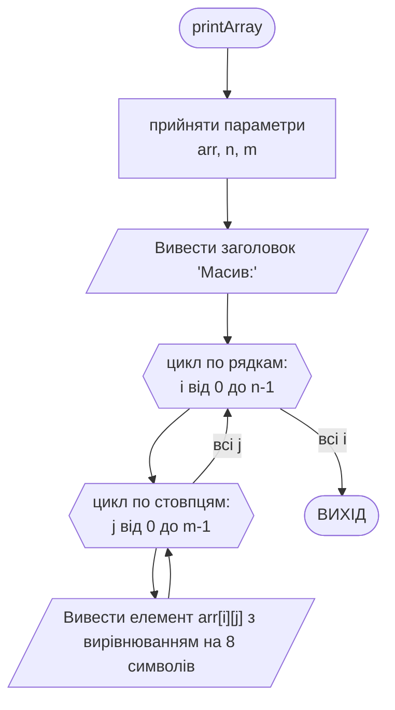
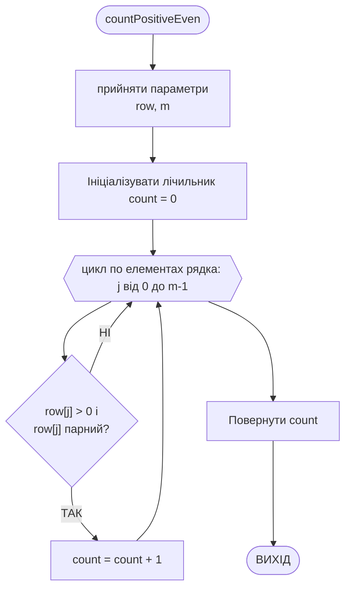
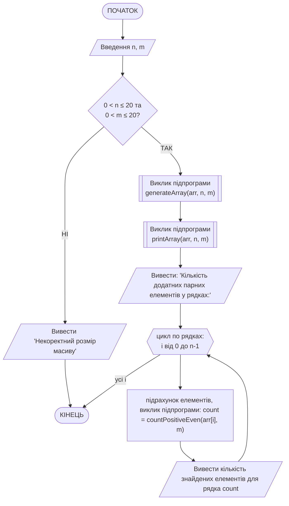

# Приклад виконання завдання ЛР07

## Текст завдання (варіант **ХХ**)

Написати програму на мові с++, яка виконує наступне завдання: ввести масив, який містить не більше 20х20 елементів цілого типу (можна створити масив з використанням генератора випадкових чисел). Для кожного його рядка обчислити та вивести на екран число позитивних парних елементів.

## Теоретичні відомості для виконання завдання

Для полегшення роботи з програмою масив цілих чисел заповнюється автоматизованим способом: за допомогою генератора псевдовипадкових чисел (ГПВЧ). Параметри ГПВЧ можуть задаватись користувачем, або можуть бути зафіксовані у програмі, наприклад, дійсні числа у діапазоні [-10; 10]. Такі умови генерації можуть бути виконані за допомогою виразу:

```cpp
// генерація цілої частини на діапазоні [0; 20], 
// зі зміщенням на 10 в бік від'ємних чисел (відняти 10)
int rand_var = (rand() % 21 - 10);
```

Для масиву встановлено максимальну розмірність 20х20, проте користувачу надається можливість вказувати довільний розмір в межах цієї розмірності. Для роботи програми можна створити фіксований масив з максимальною розмірністю, у якому буде використовуватись частина, розмірність якої буде задаватись користувачем. Для безпечного виконання програми введені користувачем значення розмірності перевіряються на відповідність вимогам.

Окремі підзадачі у програмі виконуються за допомогою підпрограм:

1) генерація елементів масиву за допомогою генератора псевдовипадкових чисел; підпрограмі передаються масив та розміри (кількість стовпців та рядків), які ввів користувач; підпрограма наповнює переданий масив цілими числами; підпрограма нічого не повертає
2) підпрограма виведення масиву в консоль (на екран); підпрограмі передаються масив та розміри (кількість стовпців та рядків), які ввів користувач; програма взаємодіє з потоком вводу/виводу і нічого не повертає по завершенні роботи
3) підпрограма підрахунку позитивних парних елементів у рядку; підпрограмі передаються поточний рядок матриці (одновимірний масив) та кількість стовпців, яку ввів користувач; програма повертає ціле число - кількість знайдених позитивних парних елементів у рядку

Основна частина завдання виконується так:

1) створюється статичний масив 20x20
2) в користувача запитуються розміри матриці, з якою треба працювати (до 20 рядків та до 20 стовпців), кожне число перевіряється на умову (0 < x <= 20), інакше робота програми припиняється
3) за допомогою підпрограми масив наповнюється цілими випадковими числами в тій частині, розміри якої задав користувач
4) за допомогою підпрограми масив виводиться у консоль (на екран)
5) організується цикл обходу матриці по рядках, в якому для кожного рядка за допомогою підпрограми знаходиться кількість позитивних парних елементів, це значення одразу виводиться у консоль (на екран)

## Програма, що виконує завдання

Ось програма на мові C++, яка виконує поставлене завдання. Вона генерує масив розміром до 20x20 (розміри задає користувач) з випадковими цілими числами (в діапазоні від -10 до 10), а потім для кожного рядка знаходить та виводить на екран число позитивних парних елементів.

```cpp
#include <iostream>
#include <cstdlib>  // rand, srand
#include <ctime>    // time
#include <iomanip>  // setw

using namespace std;

const int MAX_N = 20;
const int MAX_M = 20;

// Генерація масиву з випадковими цілими числами (у вигляді дійсних)
void generateArray(int arr[MAX_N][MAX_M], int n, int m) {
    srand(time(0));
    for (int i = 0; i < n; i++) {
        for (int j = 0; j < m; j++) {
            // Генеруємо випадкові цілі числа від -10 до 10  
            arr[i][j] = (rand() % 21 - 10);
        }
    }
}

// Виведення масиву в консоль (на екран)
void printArray(int arr[MAX_N][MAX_M], int n, int m) {
    cout << "Масив:" << endl;
    for (int i = 0; i < n; i++) {
        for (int j = 0; j < m; j++) {
            cout << setw(5) << arr[i][j];
        }
        cout << endl;
    }
}

// Підрахунок позитивних парних елементів у рядку
int countPositiveEven(int row[MAX_M], int m) {
    int count = 0;
    for (int j = 0; j < m; j++) {
        // Перевірка: число додатне і є парним цілим
        if (row[j] > 0 && row[j] % 2 == 0) {
            count++;
        }
    }
    return count;
}

int main() {
    int n, m;
    int arr[MAX_N][MAX_M];

    cout << "Введіть кількість рядків (не більше 20): ";
    cin >> n;
    cout << "Введіть кількість стовпців (не більше 20): ";
    cin >> m;

    if (n <= 0 || n > MAX_N || m <= 0 || m > MAX_M) {
        cout << "[x] Некоректний розмір масиву!" << endl;
        return 1;
    }

    // Генерація масиву
    generateArray(arr, n, m);

    // Виведення масиву
    printArray(arr, n, m);

    // Підрахунок для кожного рядка
    cout << endl;
    cout << "Кількість додатних парних елементів у рядках:" << endl;
    for (int i = 0; i < n; i++) {
        int count = countPositiveEven(arr[i], m);
        cout << "Рядок " << i + 1 << ": " << count << endl;
    }

    return 0;
}
```

## Приклад роботи програми

Приклад роботи програми для n=3 та m=5:

```bash
Введіть кількість рядків (не більше 20): 3
Введіть кількість стовпців (не більше 20): 5
Масив:
    5   -8   -5    6    7
  -10    7   -3   -9    3
   -8   -5    6    2    6

Кількість додатних парних елементів у рядках:
Рядок 1: 1
Рядок 2: 0
Рядок 3: 3
```

Приклад роботи програми для некоректних даних:

```bash
Введіть кількість рядків (не більше 20): 3
Введіть кількість стовпців (не більше 20): 24
[x] Некоректний розмір масиву!
```

## Детальний опис роботи наведеної програми

1. Оголошення констант, які обмежують максимальний розмір статичного масиву. Програма може працювати з масивом розміром не більше 20×20.
2. Введення розмірів масиву
    - Користувач вводить кількість рядків n і стовпців m.
    - Якщо введено значення поза діапазоном (≤0 або >20), програма виведе повідомлення про помилку і завершить роботу.
3. Генерація елементів масиву
Функція generateArray() заповнює двовимірний масив випадковими цілими числами від -10 до 10, перетворюючи їх у тип double.
Використовується `srand(time(0))` для ініціалізації генератора випадкових чисел, та `rand() % 21 - 10` для генерації випадкового числа від -10 до 10
4. Виведення згенерованого масиву. Функція `printArray()` друкує матрицю у табличному вигляді.
5. Підрахунок позитивних парних елементів у кожному рядку. Для кожного рядка викликається функція `countPositiveEven()`, яка:
    - перевіряє кожен елемент;
    - якщо елемент додатний (`> 0`) і парний (`int(row[j]) % 2 == 0`), збільшує лічильник;
    - повертає кількість таких елементів.
6. Виведення результатів. Для кожного рядка виводиться кількість додатних парних чисел.
7. Завершення програми. Програма завершує виконання успішно (`return 0;`).

## Схема алгоритму роботи програми

Схема алгоритму підпрограми `generateArray()`:



Схема алгоритму підпрограми `printArray()`:



Схема алгоритму підпрограми `countPositiveEven()`:



Схема алгоритму основної програми `main()`:


