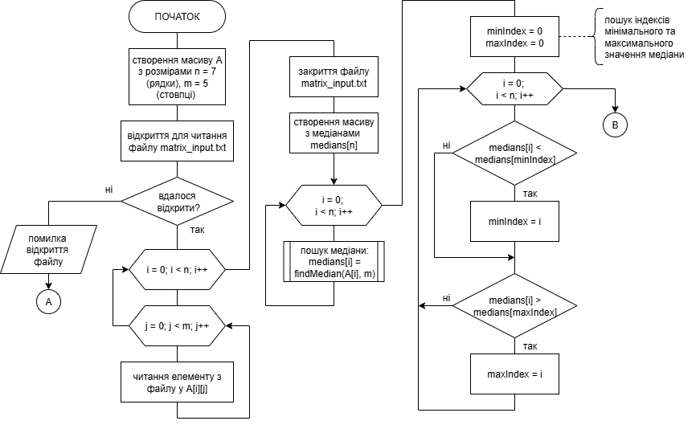
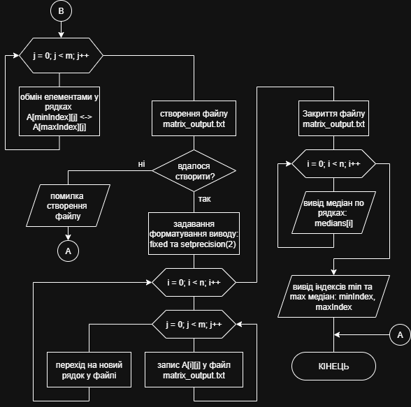
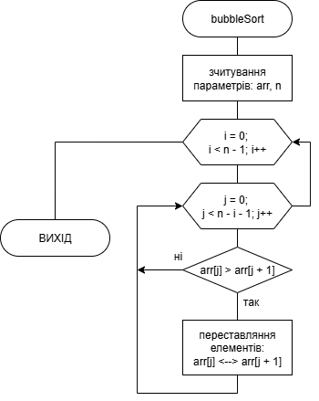
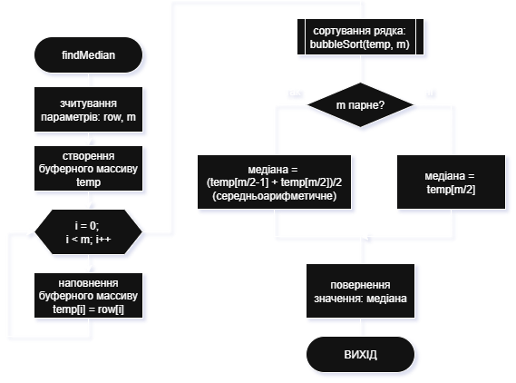
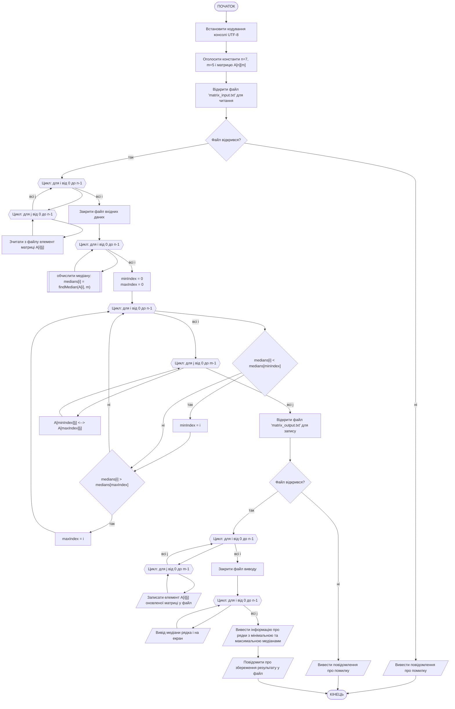
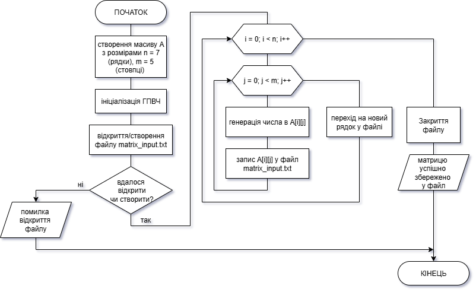
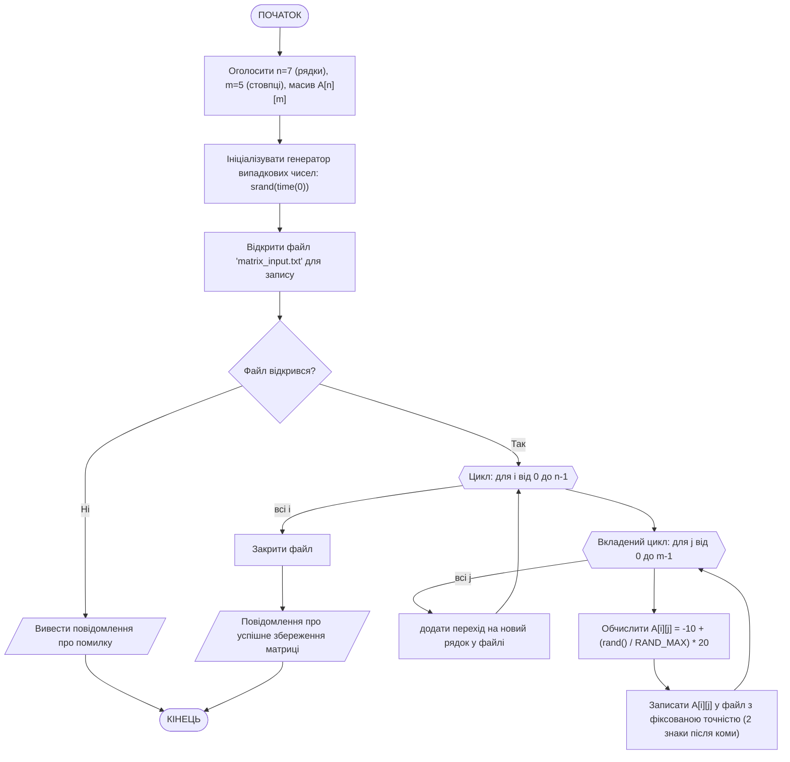

# Приклад виконання завдання ЛР08

## Текст завдання (тестовий варіант)

Зробити програму на С++, яка виконує наступне завдання:
Завантажити матрицю дійсних чисел розміром 7х5 з текстового файлу, обчислити медіану по кожному рядку, поміняти місцями рядки, у яких медіана має найбільше та найменше значення. Після цього оновлену матрицю зберегти у новий файл.

Додатково написати програму, яка створює файл з початковою матрицею, наповнюючи її дійсними числами в діапазоні (-10, 10) за допомогою генератора випадкових чисел.

## Теоретичні відомості для виконання завдання

Медіана - значення, яке розташоване по середині відсортованої послідовності чисел. Для обчислення медіани необхідно:

1) відсортувати послідовність чисел у рядку матриці, для цього необхідно використати якийсь з алгоритмів сортування.
2) знайти медіану: реалізувати універсальний алгоритм (в залежності від парної або непарної кількості елементів у рядку), для парної кількості елементів, медіана обчислюється за формулою:

    $$Медіана = \frac{X_{n/2} + X_{(n/2)+1}}{2}$$

3) для непарної кількості елементів медіана - це центральний елемент відсортованої послідовності:

    $$Медіана = X_{(n+1)/2}$$

За умовами завдання дані мають завантажуватись з текстового файлу. Для роботи з текстовими файлами у мові С++ використовується стандартна бібліотека `<fstream>`. У заголовковому файлі `<fstream>` оголошено три основні класи:

- `ifstream` - ввід із файлу (читання)
- `ofstream` - вивід у файл (запис)
- `fstream` - ввід і вивід одночасно

Відкриття файлу здійснюється одним з двох способів:

1. За допомогою конструктора:

    ```cpp
    ifstream fin("data.txt");   // відкриття для читання
    ofstream fout("output.txt"); // відкриття для запису
    ```

2. За допомогою метода `open()`:

    ```cpp
    ifstream fin;
    fin.open("data.txt");
    ```

При відкритті файлів можна використовувати додаткові прапори для визначення режиму роботи з ним:

| Прапор        | Опис                                                 |
| ------------- | ---------------------------------------------------- |
| `ios::in`     | відкриття для читання                                |
| `ios::out`    | відкриття для запису  (старий вміст буде видалено)   |
| `ios::app`    | додавання в кінець файлу                             |
| `ios::trunc`  | очищення файлу при відкритті                         |
| `ios::binary` | двійковий режим                                      |
| `ios::ate`    | встановлення вказівника в кінець файлу при відкритті |

При використанні `ifstream` та `ofstream` ящо не вказувати режим явно, він обирається автоматично (відповідно `ios::in` та `ios::out`). Іноді виникає потреба відкрити файл для дозапису даних, без видалення вже існуючих у файлі. Тоді слід вказувати режим явно, наприклад:

```cpp
ofstream fout("log.txt", ios::app);
```

Перевірка відкриття файлу здійснюється через його вказівник:

```cpp
ifstream fin("data.txt");
if (!fin) {
    cout << "Не вдалося відкрити файл!" << endl;
}
```

або за допомогою методу `is_open()`:

```cpp
ifstream fin("data.txt");
if (!fin.is_open()) {
    cout << "Помилка відкриття файлу!" << endl;
}
```

Після використання файл слід закривати:

```cpp
fin.close();
```

Після відкриття запис у файл здійснюється так само, як і вивід у консоль, тільки використовується вказівник файла:

```cpp
fout << "Hello, file!" << endl;
fout << 123 << " " << 45.6 << endl;
```

Читання даних з файлу може здійснюватись одним зі способів:

1. Построчно, за допомогою функції `getline()`: `string line; getline(fin, line);`
2. Послівно, за принципом, схожим на зчитування даних з `cin`: `fin >> word`, оператор `>>` автоматично читає наступну послідовність символів, пропускаючи будь-яку кількість пробілів, символів табуляції чи переходів рядка.
3. По символах: `char ch; fin.get(ch);`

## Програма, що виконує завдання

### Текст основної програми

Ось програма на C++, яка виконує поставлене завдання (main_lab08.cpp):

```cpp
#include <iostream>
#include <fstream>
#include <iomanip>
#include <cstdlib>
#include <ctime>
#include <cmath> // для fabs()
#include <windows.h> // для SetConsoleOutputCP

using namespace std;

// Функція сортування одного рядка методом бульбашки
void bubbleSort(double arr[], int n) {
    for (int i = 0; i < n - 1; i++) {
        for (int j = 0; j < n - i - 1; j++) {
            if (arr[j] > arr[j + 1]) {
                double temp = arr[j];
                arr[j] = arr[j + 1];
                arr[j + 1] = temp;
            }
        }
    }
}

// Функція для знаходження медіани одного рядка
double findMedian(double row[], int m) {
    double temp[5];
    for (int i = 0; i < m; i++) temp[i] = row[i];

    bubbleSort(temp, m); // сортуємо копію рядка

    if (m % 2 == 1)
        return temp[m / 2];
    else
        return (temp[m / 2 - 1] + temp[m / 2]) / 2.0;
}

int main() {
    // Перемикаємо консоль у UTF-8
    SetConsoleOutputCP(CP_UTF8);

    const int n = 7;
    const int m = 5;
    double A[n][m];

    // === 1. Зчитування матриці з файлу ===
    ifstream fin("matrix_input.txt");
    if (!fin) {
        cerr << "Помилка відкриття файлу для читання!" << endl;
        return 1;
    }

    for (int i = 0; i < n; i++) {
        for (int j = 0; j < m; j++) {
            fin >> A[i][j];
        }
    }
    fin.close();

    // === 2. Обчислення медіани для кожного рядка ===
    double medians[n];
    for (int i = 0; i < n; i++) {
        medians[i] = findMedian(A[i], m);
    }

    // === 3. Пошук рядків з мінімальною і максимальною медіанами ===
    int minIndex = 0, maxIndex = 0;
    for (int i = 1; i < n; i++) {
        if (medians[i] < medians[minIndex]) minIndex = i;
        if (medians[i] > medians[maxIndex]) maxIndex = i;
    }

    // === 4. Обмін рядків місцями ===
    for (int j = 0; j < m; j++) {
        double temp = A[minIndex][j];
        A[minIndex][j] = A[maxIndex][j];
        A[maxIndex][j] = temp;
    }

    // === 5. Запис оновленої матриці у новий файл ===
    ofstream fout("matrix_output.txt");
    if (!fout) {
        cerr << "Помилка відкриття файлу для запису!" << endl;
        return 1;
    }

    fout << fixed << setprecision(2);
    for (int i = 0; i < n; i++) {
        for (int j = 0; j < m; j++) {
            fout << setw(8) << A[i][j] << " ";
        }
        fout << endl;
    }
    fout.close();

    // === 6. Вивід результатів на екран ===
    cout << "Медіани по рядках:" << endl;
    for (int i = 0; i < n; i++) {
        cout << "Рядок " << i + 1 << ": " << medians[i] << endl;
    }

    cout << "\nМінімальна медіана у рядку " << minIndex + 1
         << ", максимальна — у рядку " << maxIndex + 1 << endl;

    cout << "Оновлену матрицю збережено у файл 'matrix_output.txt'" << endl;

    return 0;
}
```

### Пояснення принципів роботи програми

1. **Функція bubbleSort(double arr[], int n)**: бере масив `arr` довжиною `n` та здійснює сортування по зростанню значень його елементів (порядок сортування на справді є непринциповим, можна сортувати і по спаданню).
2. **Функція findMedian(double row[], int m)**: бере поточний рядок матриці row з кількістю елементів m, виконує сортування, та, в залежності від парності адо непарності кількості елементів здійснює розрахунок медіани.
3. **Основна програма main()**:
   - зчитує дані з файла, виводить матрицю на екран
   - здійснює пошук медіан по кожному рядку матриці та запис у вектор медіан
   - здійснює пошук рядків (індексів) з min та max значеннями медіан
   - виконує обмін рядків
   - зберігає змінену матрицю у файл
   - виводить змінену матрицю на екран

### Приклад результатів роботи програми

Перед виконанняя програми необхідно створити файл **matrix_input.txt** з наступним вмістом:

```bash
    4.51     8.84    -7.98     7.43    -4.06 
    7.38     8.55     9.37    -8.46     8.47 
    5.45     6.83     8.77     5.57    -5.29 
   -3.34     8.70    -9.13     3.55    -4.21 
   -5.32     1.77     7.48     4.59    -5.05 
   -4.48    -1.13     3.63     4.82     5.14 
   -8.34     2.02    -5.90    -0.21    -7.17 
```

Після виконання програма виводить в консоль:

```bash
Медіани по рядках:
Рядок 1: 4.51
Рядок 2: 8.47
Рядок 3: 5.57
Рядок 4: -3.34
Рядок 5: 1.77
Рядок 6: 3.63
Рядок 7: -5.9

Мінімальна медіана у рядку 7, максимальна — у рядку 2
Оновлену матрицю збережено у файл 'matrix_output.txt'
```

Результат обробки матриці програма зберігає у файл **matrix_outpput.txt**:

```bash
    4.51     8.84    -7.98     7.43    -4.06 
   -8.34     2.02    -5.90    -0.21    -7.17 
    5.45     6.83     8.77     5.57    -5.29 
   -3.34     8.70    -9.13     3.55    -4.21 
   -5.32     1.77     7.48     4.59    -5.05 
   -4.48    -1.13     3.63     4.82     5.14 
    7.38     8.55     9.37    -8.46     8.47 
```

### Схема алгоритму програми

Алгоритм роботи основної програми можна описати наступним чином:

1. Зчитування початкових даних.
    - Відкрити файл з початковими даними.
    - Якщо не вдалося відкрити файл - вивести повідомлення про помилку та завершити програму
    - Зчитати матрицю з файлу у заздалегідь підготовлений масив у пам'яті.
    - Закрити файл з початковими даними.
2. Вивести початкову матрицю на екран.
3. Пошук медіан по кожному рядку матриці та запис у вектор медіан.
    - відсортувати елементи у рядку
    - взяти середній елемент, якщо кількість елементів непарна
    - взяти середне арифметричне двох середніх елементів, якщо кількість елементів парна
4. Пошук рядків з мінімальним та максимальним значеннями медіани.
5. Обмін рядків у матриці.
6. Збереження зміненої матриці у файл.
    - Відкрити або створити файл для виведення
    - Якщо не вдалося відкрити або створити файл - вивести повідомлення про помилку та завершити програму
    - Записати змінену матрицю у файл
    - Закрити файл
7. Вивести змінену матрицю на екран.

Схема алгоритму основної програми `main()` (файл **main_lab08.cpp**):





Схема алгоритму підпрограми `bubbleSort()` (файл **main_lab08.cpp**):



Схема алгоритму підпрограми `findMedian()` (файл **main_lab08.cpp**):





## Додаткове завдання

Для полегшення роботи з даними була додатково створена програма, яка наповнює файл з початковою матрицею заданого розміру. Програма створює текстовий файл і наповнює його дійсними числами в діапазоні (-10, 10) за допомогою генератора випадкових чисел у вигляді матриці з заданими користувачем розмірами.

### Текст програми додаткового завдання

Ось програма на C++, яка виконує додаткове завдання (generator.cpp):

```cpp
#include <iostream>
#include <fstream>
#include <iomanip> // setw(), setprecision()
#include <cstdlib>
#include <ctime>
#include <windows.h> // для SetConsoleOutputCP

using namespace std;

int main() {
    // Перемикаємо консоль у UTF-8
    SetConsoleOutputCP(CP_UTF8);

    const int n = 7;  // кількість рядків
    const int m = 5;  // кількість стовпців
    double A[n][m];

    srand(time(0)); // ініціалізація генератора випадкових чисел

    ofstream fout("matrix_input.txt");
    if (!fout) {
        cerr << "Помилка відкриття файлу для запису!" << endl;
        return 1;
    }

    // Генеруємо матрицю з випадкових дійсних чисел у діапазоні (-10; 10)
    for (int i = 0; i < n; i++) {
        for (int j = 0; j < m; j++) {
            A[i][j] = -10 + (rand() / (double)RAND_MAX) * 20; // випадкове число (-10; 10)
            fout << setw(8) << fixed << setprecision(2) << A[i][j] << " ";
        }
        fout << endl;
    }

    fout.close();
    cout << "Матрицю успішно збережено у файл 'matrix_input.txt'" << endl;

    return 0;
}
```

### Пояснення принципів роботи програми (generator.cpp)

1. Створення матриці необхідного розміру (розміри задаються константами).
2. Ініціалізація ГПВЧ за допомогою мітки поточного часу `srand(time(0));`.
3. Відкриття/створення текстового файлу на запис. Перевілка успішності операції.
4. Цикл генерації елементів матриці - дійсних чисел на діапазоні (-10; 10). Сгенеровані числа записуються у відповідну кількість стовпці та рядків з відступом setw(8) та точністю setprecision(2).
5. Закриття файлу

### Схема алгоритму програми (generator.cpp)

Схема алгоритму додаткової програми (файл **generator.cpp**):




