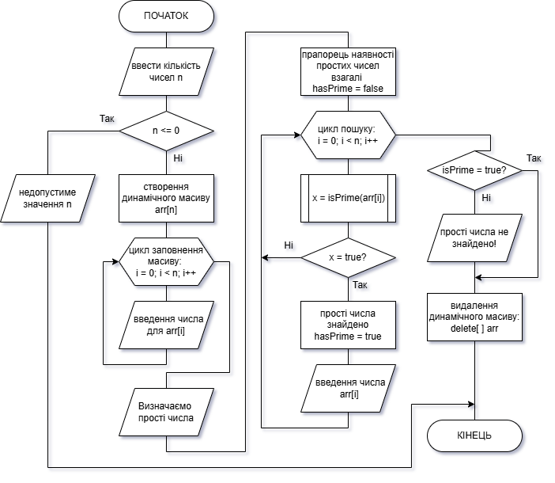
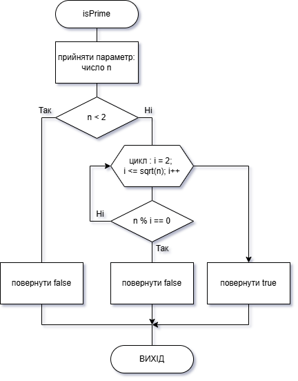
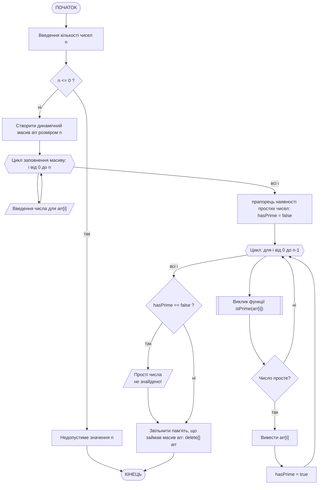

# Приклад виконання завдання ЛР09

## Текст завдання (тестовий варіант)

Скласти блок-схему алгоритму та написати програму для розв’язання завдання відповідно до індивідуального варіанта. Розв’язання завдання організувати за допомогою функцій, тобто основна програма повинна містити код для введення вхідних даних, виклик функції, в якій реалізовано розв’язання, та код для виведення результатів на екран.
Індивідуальний варіант завдання (зразок): треба створити програму на мові С++, яка виконує визначення чи є число простим, чи ні. Визначення простоти числа зробити за допомогою функції. В основній програмі виконується запит довільної кількості чисел у користувача, числа записуються у динамічний масив, і потім по черзі до кожного з них застосовується функція. Користувачеві виводиться результат у вигляді переліку лише тих чисел, що є простими, якщо таких немає видати повідомлення, що простих чисел немає.

## Теоретичні відомості для виконання завдання

Просте число — це натуральне число більше за 1, яке ділиться лише на 1 і саме на себе (наприклад: 2, 3, 5, 7, 11, 13, 17). Для визначення того, чи є число простим, спочатку необхідно відкинути множину очевидно непростих чисел — усі числа менші 2 (тобто 0, 1, від’ємні) не можуть бути простими. Далі визначення простоти числа здійснюється за допомогою оператору `%`. У мові С++ оператор `%` знаходить остачу від ділення. Якщо `n % i == 0`, це означає, що `i` ділить `n` націло, а отже `n` не є простим.
Перебирати всі числа до `n - 1` також не має сенсу, оскільки якщо число має дільник, принаймні один із них не перевищує $\sqrt{n}$. Якщо обидва множники були б більші за $\sqrt{n}$, тоді їх добуток буде більший за $n$.

Наприклад, для n = 36: $\sqrt{36}$ = 6, можливі пари дільників: (2,18), (3,12), (4,9), (6,6) — усі малі дільники ≤ 6.Тому перевіряти числа більші за $\sqrt{n}$ немає сенсу — дільник уже знайдеться раніше. Це значно прискорює перевірку для великих чисел.

Завданням визначено введення користувачем довільної кількості чисел. Це означає, що заздалегідь виділити достатній об'єм пам'яті під масив з числами неможливо. Для виконання цієї умови в програмі використовується створення та використання динамічного масиву.
У користувача спочатку запитується кількість чисел `n`, яку він планує ввести і потім  створюється масив із такою кількістю елементів у динамічній пам’яті, її обсяг визначається під час виконання програми залежно від введеного користувачем значення: `int* arr = new int[n];`
Після завершення роботи з масивом виконується оператор `delete[] arr;` який звільняє раніше виділену пам’ять, запобігаючи її витоку (після завершення програми пам'ять, що була зайнята програмою, все одно повертається у розпорядження операційній системі).

## Програма, що виконує завдання

### Текст основної програми

Ось програма на C++, яка виконує поставлене завдання (main_lab09.cpp):

```cpp
#include <iostream>
#include <cmath>
using namespace std;

// Функція перевірки простоти числа
bool isPrime(int n) {
    if (n < 2) return false;          // 0, 1, від’ємні — не прості
    for (int i = 2; i <= sqrt(n); i++) {
        if (n % i == 0) return false; // має дільник → не просте
    }
    return true;                      // якщо дільників не знайдено
}

int main() {
    int n;
    cout << "Введіть кількість чисел: ";
    cin >> n;

    if (n <= 0) {
        cout << "Невірна кількість елементів!" << endl;
        return 1;
    }

    // Створення динамічного масиву
    int* arr = new int[n];

    cout << "Введіть " << n << " цілих чисел: ";
    for (int i = 0; i < n; i++) {
        cin >> arr[i];
    }

    cout << endl << "Прості числа серед введених: ";

    bool hasPrime = false;  // прапорець — чи знайдено прості

    for (int i = 0; i < n; i++) {
        if (isPrime(arr[i])) {
            cout << arr[i] << " ";
            hasPrime = true;
        }
    }

    if (!hasPrime)
        cout << "немає простих чисел.";

    cout << endl;

    delete[] arr;  // звільнення пам'яті
    return 0;
}
```

### Пояснення принципів роботи програми

Програма визначає, які з введених користувачем чисел є простими:

- в користувача запитується кількість чисел.
- програма зчитує самі числа в динамічний масив.
- для кожного числа викликається функція isPrime().
- виводяться усі прості числа, або повідомляється, що їх немає.

Програма складається з двох частин:

1. Функція `isPrime(int n)` — виконує перевірку простоти числа.
2. Основна функція `main()` — керує введенням даних, їх обробкою і виведенням результатів.

Функція `isPrime(int n)` визначає, чи є число n простим. Принцип її роботи:

1. Якщо n < 2 — відразу повертається false (тобто числа 0, 1 та від’ємні не є простими).
2. Програма перевіряє, чи ділиться n на будь-яке число від 2 до $\sqrt{n}$.
3. Якщо знайдено хоч один дільник (`n % i == 0`) — число не є простим, повертається false.
4. Якщо жодного дільника не знайдено — число просте, повертається true.

Робота функції `main()`:

1. Користувач вводить кількість елементів. Якщо введено некоректне число (нуль або менше) — програма завершує роботу.
2. Створюється динамічний масив на n елементів.
3. Користувач вводить усі числа по черзі. Вони зберігаються у динамічному масиві `arr`.
4. Для кожного елемента масиву викликається `isPrime()`.
5. Якщо функція повертає `true`, число виводиться. Змінна-прапорець `hasPrime` запам’ятовує, чи були знайдені прості числа.
6. Якщо після перевірки жодного простого числа не знайдено (`hasPrime == false`), виводиться повідомлення.
7. Після завершення роботи динамічний масив видаляється з пам’яті (пам’ять звільняється для подальшого використання).

### Приклад виконання

У випадку, коли серед введених є прості числа:

```bash
Введіть кількість чисел: 6
Введіть 6 цілих чисел: 8 11 15 3 4 17

Прості числа серед введених: 11 3 17
```

Якщо простих чисел немає:

```bash
Введіть кількість чисел: 4
Введіть 4 цілих чисел: 8 10 12 15

Прості числа серед введених: немає простих чисел.
```

### Схема алгоритму програми

Схема алгоритму основної програми `main()` (файл **lab09_main.cpp**):






