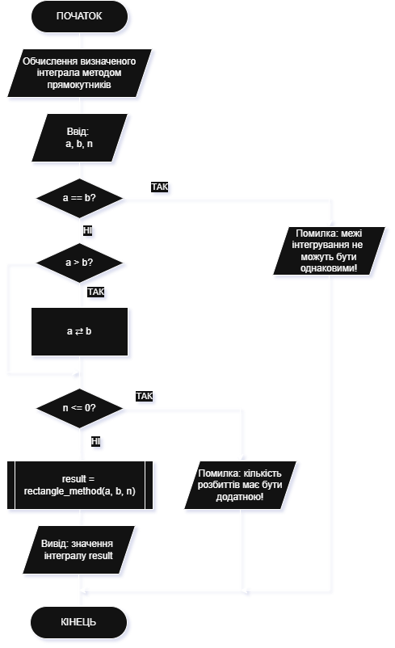
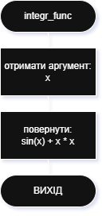
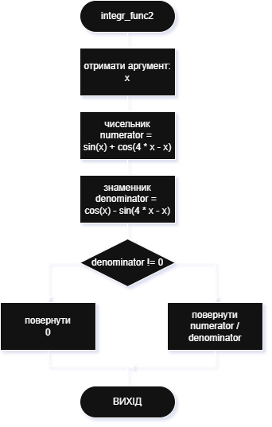
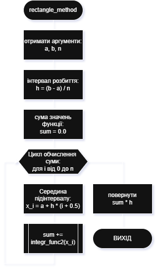

# Приклад виконання завдання ЛР10

## Текст завдання (тестовий варіант)

Скласти блок-схему алгоритму та написати програму на мові С++ для розв’язання завдання відповідно до індивідуального варіанта. Програма повинна здійснювати розрахунок значення інтегралу заданої індивідуальним варіантом функції за допомогою чисельного методу прямокутників. Розрахунок значення заданої функції, а також реалізація методу прямокутників повинні бути оформлені у вигляді окремих підпрограм (функцій). Основна програма повинна містити код для введення вхідних даних: інтервал інтегрування $[a; b]$ та параметр розбиття $h$, виклик функції, в якій реалізовано розрахунок значення інтегралу, та код для виведення результатів на екран.
Зразок математичної функції, для якої необхідно обчислити інтеграл:

Варіант фукції 1:
$$f(x) = \sin(x) + x^2$$

Варіант функції 2:
$$f(x) = \frac{\sin(x) + \cos(x)}{\cos(x) - \sin(x)}$$

## Теоретичні відомості для виконання завдання

Принцип методу прямокутників
Метод прямокутників — це чисельний спосіб наближеного обчислення визначеного інтеграла:

$$I=\int_{a}^{b}​f(x)dx$$

Інтеграл — це площа під графіком функції $f(x)$ на проміжку $[a,b]$.
Якщо складно знайти точне значення інтеграла аналітично, ми можемо наблизити площу цієї фігури, поділивши її на вузькі прямокутники.
Інтервал $[a,b]$ ділимо на $n$ рівних частин:

$$h=\frac{b-a}{n}$$

Точки розбиття:

$$x_0​=a,\quad x_1​=a+h,\quad x_2​=a+2h,\quad …,\quad x_{n-1}​=b$$


На кожному підінтервалі $[x_i,x_{i+1}]$ беремо одне значення функції (висоту прямокутника). Залежно від того, в якій точці беремо значення, метод буває трьох видів:

| Варіант                    | Формула для точки               | Коментар                                             |
| -------------------------- | ------------------------------- | ---------------------------------------------------- |
| **Лівих прямокутників**    | $(x_i = a + i \cdot h)$         | Висота береться по лівому краю                       |
| **Правих прямокутників**   | $(x_i = a + (i+1) \cdot h)$     | Висота по правому краю                               |
| **Середніх прямокутників** | $(x_i = a + h \cdot (i + 0.5))$ | Висота в середині підінтервалу (найточніший варіант) |


Загальна формула обчислення інтеграла методом прямокутників:

$$I \approx h \sum_{i=0}^{n-2} f\big(x_i\big)$$

З формулами для точки:

$$I \approx h \sum_{i=1}^{n-2} f\big(a + h \cdot i\big)$$

$$I \approx h \sum_{i=0}^{n-2} f\big(a + h \cdot (i + 1)\big)$$

$$I\approx h\sum_{i=0}^{n-2} f\big(a + h \cdot (i + 0.5)\big)$$

## Програма, що виконує завдання

### Текст основної програми

Ось програма на C++, яка виконує поставлене завдання (main_lab10.cpp):

```cpp
#include <iostream>
#include <cmath>     // для математичних функцій

using namespace std;

// --- Підінтегральна функція (змінюється за варіантом) ---
double integr_func(double x) {
    // приклад: f(x) = sin(x) + x^2
    return sin(x) + x * x;
}

// --- Підінтегральна функція - альтернативний приклад ---
double integr_func2(double x) {
    // f(x) = (sin(x) + cos(4x - x)) / (cos(x) - sin(4x - x))

    // Переведення з градусів у радіани
    // double x = ang * M_PI / 180.0;

    double numerator = sin(x) + cos(x);
    double denominator = cos(x) - sin(x);

    if (fabs(denominator) < 1e-9) {  // запобігання діленню на 0
        return 0;
    }

    return numerator / denominator;
}

// --- Функція для обчислення інтеграла методом прямокутників ---
double rectangle_method(double a, double b, int n) {
    double h = (b - a) / n;  // крок розбиття
    double sum = 0.0;

    // метод середніх прямокутників
    for (int i = 0; i < n; i++) {
        double x_i = a + h * (i + 0.5); // середина підінтервалу
        sum += integr_func(x_i);
    }

    return sum * h;
}

int main() {
    cout << "Обчислення визначеного інтеграла методом прямокутників" << endl;

    double a, b;
    int n;

    // --- Введення даних ---
    cout << "Введіть нижню межу інтегрування a: ";
    cin >> a;
    cout << "Введіть верхню межу інтегрування b: ";
    cin >> b;
    cout << "Введіть кількість розбиттів n: ";
    cin >> n;

    // --- Перевірка коректності введених даних ---
    if (a == b) {
        cout << "Помилка: межі інтегрування не можуть бути однаковими!\n";
        return 1;
    } else {
        if (a > b) {
            swap(a, b);
        }
    }

    if (n <= 0) {
        cout << "Помилка: кількість розбиттів має бути додатною!\n";
        return 1;
    }

    // --- Обчислення інтеграла ---
    double result = rectangle_method(a, b, n);

    // --- Виведення результату ---
    cout << "\nІнтеграл від a = " << a << " до b = " << b << " дорівнює: "
         << result << endl;

    return 0;
}
```

### Пояснення принципів роботи програми

Програма складається з трьох основних функцій:

1. Підінтегральна функція. В програмі реалізовано дві альтернативні підінтегральні функції:
    - `integr_func(x)` - функція 1 (відповідно до завдання) -- проста функція, що повертає суму синуса та квадрата аргументу
    - `integr_func2(x)` - функція 2 (відповідно до завдання) -- більш складна тригонометрична функція у вигляді дробу, яка має періодичні розриви, має захист від ділення на нуль (повертає 0, якщо знаменник близький до 0)
2. `rectangle_method(a, b, n)` - функція обчислення інтеграла методом прямокутників (в прикладі реалізовано метод середніх прямокутників)
3. `main()` - головна функція програми, яка забезпечує введення, перевірку коректності даних: межі інтегрування `a` та `b`, а також кількість розбиттів `n`, виконує обчислення значення інтегралу та виводить його на екран

### Приклад виконання

Приклад роботи для функції `integr_func()`:

```bash
Обчислення визначеного інтеграла методом прямокутників
Введіть нижню межу інтегрування a: 0 
Введіть верхню межу інтегрування b: 1
Введіть кількість розбиттів n: 100

Інтеграл від a = 0 до b = 1 дорівнює: 0.793025
```

Для перевірки правильності результату можна скористатись можливостями порталу Wolfram Alpha: [посилання](https://www.wolframalpha.com/input?i=integrate+sin+x+%2B+x%5E2+dx+from+x%3D0+to+1)

```bash
Обчислення визначеного інтеграла методом прямокутників
Введіть нижню межу інтегрування a: 0
Введіть верхню межу інтегрування b: 10
Введіть кількість розбиттів n: 1000

Інтеграл від a = 0 до b = 10 дорівнює: 335.172
```

Для перевірки правильності результату можна скористатись можливостями порталу Wolfram Alpha: [посилання](https://www.wolframalpha.com/input?i=integrate+sin+x+%2B+x%5E2+dx+from+x%3D0+to+10)

Приклад роботи для функції `integr_func2()`:

```bash
Введіть нижню межу інтегрування a: 1
Введіть верхню межу інтегрування b: 3
Введіть кількість розбиттів n: 1000

Інтеграл від a = 1 до b = 3 дорівнює: -1.32328
```

Для перевірки правильності результату можна скористатись можливостями порталу Wolfram Alpha: [посилання](https://www.wolframalpha.com/input?i=integrate+%28sin%28x%29+%2B+cos%28x%29%29+%2F+%28cos%28x%29+-+sin%28x%29%29+dx+from+1+to+3)

### Схема алгоритму програми

Схеми алгоритмів основної програми `main()` (файл **lab10_main.cpp**) та підпрограм:

- підпрограма першої математичної функції відповідно до варіанту `integr_func()`
- підпрограма другої математичної функції відповідно до варіанту `integr_func2()`
- підпрограма обчислення інтегралу методом прямокутників `rectangle_method()`

Алгоритм основної програми `main()`



Алгоритм підпрограми першої математичної функції відповідно до варіанту `integr_func()`



Алгоритм підпрограми другої математичної функції відповідно до варіанту `integr_func2()`



Алгоритм підпрограми обчислення інтегралу методом прямокутників `rectangle_method()`


