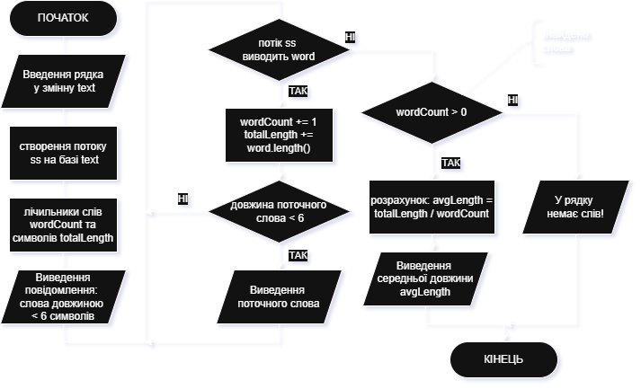
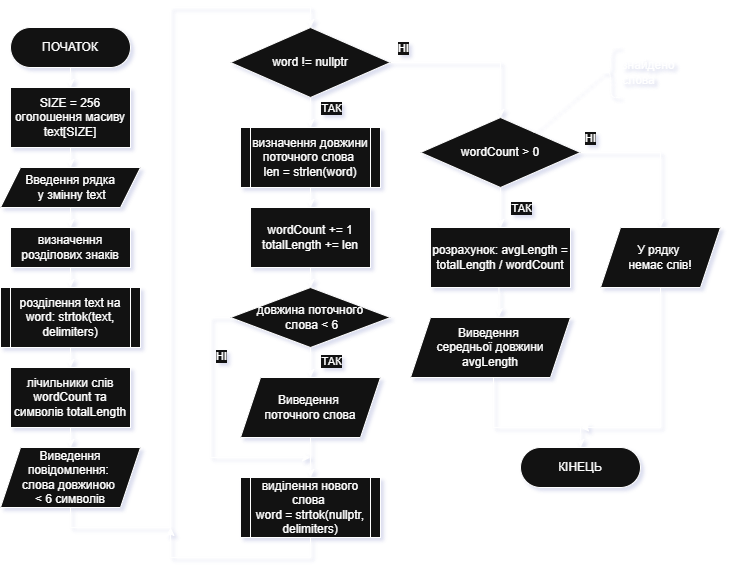

# Приклад виконання завдання ЛР11

## Текст завдання (тестовий варіант)

Скласти алгоритми та написати програми мовою С++ для розв’язання наступних завдань відповідно до індивідуального варіанту з використанням стандартних функцій для опрацювання рядків:

- Визначити середню довжину слів у рядку, що вводиться користувачем
- Вивести слова рядка, довжина яких менше 6 символів, та їх порядкові номери

## Теоретичні відомості для виконання завдання

- Спосіб виначення слів у рядку та визначення їх довжини: один з можливих способів - використання бібліотеки `sstream` та об'єкту `stringstream`, в такому разі рядок буде розглядатись як потік (аналогічно `cin`) і звернення до потоку буде відокремлювати з нього фрагмент з символами до наступного пробілу. Другий способ - бібліотека `cstring` та функція `strtok(text, delimiters)`, в якій рядок розділяється на підрядки по символам, перерахованим в рядку `delimiters`. Якщо рядок оголошений з використанням об'єкту `string`, то можна скористатись методом `length()`, якщо ж рядок представлений як масив `char`, то для визначення довжини рядка використовується функція `strlen()`.
- Метод визначення середньої довжини слів у тексті: середня довжина слів у тексті визначається шляхом накопичення суми довжин усіх слів (після відокремлення слів у тексті) та підрахунку кількості відокремлених слів. Далі залишається лише розділити накопичену суму на загальну кількість за формулою:

$$avgLength = \frac{totalLength}{wordCount}$$

- Спосіб відокремлення та виведення слів з довжиною до 6 символів: слова відокремлюються одним зі способів визначення слів, наведених раніше. Якщо довжина менше 6 - слово виводиться на екран.
- Нумерація слів у тексті, наданому користувачем: під час відокремлення слів від загального тексту здійснюється їх підрахунок за допомогою окремої змінної, поточне значення змінної буда позначати порядковий номер слова. У другому способі, коли слова відокремлюються одразу, виведення номера здійснюється в процесі проходження по окремим словам за допомогою створеного вказівника у циклі, одночасно з цим інкрементується змінна-лічильник.
- Методи чи функції, які застосовуються у програмі: в залежності від обраного способу роботи з рядками використовуються методи об'єктів, або функції. В першому способі активно використовується метод `length()`, у другому способі - функції `getline(cin, text)`, `strlen()`, `strtok()`.

## Програма, що виконує завдання

Далі наведено приклади програм, одна з яких працює зі стандартним класом `string`, який є доступним для програм у мові С++, а друга використовує формат представлення рядків так, як це було успадковано від мови С, тобто у вигляді масивів символів `char[]`.

### Текст основної програми (клас `string`)

Запропонована програма використовує різні можливості стандартних бібліотек по роботі з рядками у мові С++, зокрема бібліотек `<string>` та `<sstream>`: класи `string` та `stringstream`, їх можливості та методи (`length()`). Для зчитування рядка використовується функція `getline(cin, text)`.
Ось програма на C++, яка виконує поставлене завдання (lab11_main.cpp):

```cpp
#include <iostream>
#include <string>
#include <sstream>   // для роботи з потоками рядків
#include <iomanip>   // для форматування виводу setprecision

using namespace std;

int main() {

    string text;
    cout << "Введіть рядок: ";
    getline(cin, text);

    stringstream ss(text);
    string word;
    int wordCount = 0;
    int totalLength = 0;

    cout << "\nСлова довжиною менше 6 символів:\n";

    int index = 0;
    while (ss >> word) {
        ++wordCount;
        totalLength += word.length();

        if (word.length() < 6) {
            cout << setw(2) << wordCount << ") " << word << " (довжина: " << word.length() << ")\n";
        }
    }

    if (wordCount > 0) {
        double avgLength = static_cast<double>(totalLength) / wordCount;
        cout << fixed << setprecision(2);
        cout << "\nСередня довжина слів у рядку: " << avgLength << endl;
    } else {
        cout << "У рядку немає слів!" << endl;
    }

    return 0;
}
```

### Пояснення принципів роботи програми (клас `string`)

Пояснення роботи програми

1. `getline(cin, text)` — читає весь рядок, включно з пробілами.
2. `stringstream ss(text)` — дозволяє розбити рядок на окремі слова.
3. Підраховується:
    - `wordCount` — кількість слів;
    - `totalLength` — сумарна довжина усіх слів  в символах.
4. Для кожного слова перевіряється умова `word.length() < 6`, і такі слова виводяться разом із їх порядковим номером.
5. В кінці обчислюється середня довжина слів:

$$avgLength = \frac{totalLength}{wordCount}$$

### Приклад виконання програми (клас `string`)

Приклад роботи програми для даних `The site is in a temporary read-only mode to facilitate some long-overdue software updates. We apologize for any inconvenience this may cause!`:

```bash
Введіть рядок: The site is in a temporary read-only mode to facilitate some long-overdue software updates. We apologize for any inconvenience this may cause!

Слова довжиною менше 6 символів:
 1) The (довжина: 3)
 2) site (довжина: 4)
 3) is (довжина: 2)
 4) in (довжина: 2)
 5) a (довжина: 1)
 8) mode (довжина: 4)
 9) to (довжина: 2)
11) some (довжина: 4)
15) We (довжина: 2)
17) for (довжина: 3)
18) any (довжина: 3)
20) this (довжина: 4)
21) may (довжина: 3)

Середня довжина слів у рядку: 5.50
```

### Текст основної програми (C-рядки)

У разі, якщо потрібно працювати з рядками за принципом, як у мові С, то використовуються так звані С-рядки (масиви символів `char[]`) та можливості бібліотеки `<cstring>` (функції `strlen()`, `strtok()`).
В такому разі програма, що реалізує завдання, буде виглядати наступним чином (lab11_main_cstr.cpp):

```cpp
#include <iostream>
#include <cstring>   // для strlen, strtok
#include <iomanip>   // для форматування виводу
using namespace std;

int main() {

    const int SIZE = 256;
    char text[SIZE];

    cout << "Введіть рядок: ";
    cin.getline(text, SIZE);

    char delimiters[] = " ,.!?;:-\t\n";  // символи, які розділяють слова
    char* word = strtok(text, delimiters);

    int wordCount = 0;
    int totalLength = 0;

    cout << "\nСлова довжиною менше 6 символів:\n";

    while (word != nullptr) {
        ++wordCount;
        int len = strlen(word);
        totalLength += len;

        if (len < 6) {
            cout << setw(2) << wordCount << ") " << word << " (довжина: " << len << ")\n";
        }

        word = strtok(nullptr, delimiters);
    }

    if (wordCount > 0) {
        double avgLength = static_cast<double>(totalLength) / wordCount;
        cout << fixed << setprecision(2);
        cout << "\nСередня довжина слів у рядку: " << avgLength << endl;
    } else {
        cout << "У рядку немає слів!" << endl;
    }

    return 0;
}
```

### Пояснення принципів роботи програми (C-рядки)

1. `getline(text, SIZE)` — читає весь рядок, включно з пробілами.
2. `strtok(text, delimiters)` — розділяє рядок на окремі слова, повертає вказівник на послідовність слів (`char* word`). Розділення відбувається по символам, переліченим у рядку `delimiters`.
3. Підраховується:
    - `wordCount` — кількість слів;
    - `totalLength` — сумарна довжина усіх слів  в символах.
4. Для кожного слова визначається довжина `strlen(word)` і перевіряється умова `len < 6`, такі слова виводяться разом із їх порядковим номером.
5. Кожне наступне слово відокремлюється за допомогою `word = strtok(nullptr, delimiters)`.
6. В кінці обчислюється та виводиться середня довжина слів:

$$avgLength = \frac{totalLength}{wordCount}$$

### Приклад виконання програми (C-рядки)

Приклад роботи програми для даних `The site is in a temporary read-only mode to facilitate some long-overdue software updates. We apologize for any inconvenience this may cause!`:

```bash
Введіть рядок: The site is in a temporary read-only mode to facilitate some long-overdue software updates. We apologize for any inconvenience this may cause!

Слова довжиною менше 6 символів:
 1) The (довжина: 3)
 2) site (довжина: 4)
 3) is (довжина: 2)
 4) in (довжина: 2)
 5) a (довжина: 1)
 7) read (довжина: 4)
 8) only (довжина: 4)
 9) mode (довжина: 4)
10) to (довжина: 2)
12) some (довжина: 4)
13) long (довжина: 4)
17) We (довжина: 2)
19) for (довжина: 3)
20) any (довжина: 3)
22) this (довжина: 4)
23) may (довжина: 3)
24) cause (довжина: 5)

Середня довжина слів у рядку: 4.88
```

> Note: зверніть увагу на різницю у роботі обох програм на однакових даних: перша у якості розділювача розглядає лише пробіл, тоді як у другій програмі перелік розділювачей визначено явно і серед них є розділові знаки та дефіс.
> Через це відрізняється список слів, що коротші за 6 символів та характеристика середньої довжини.

### Схема алгоритму програми

Схеми алгоритмів основної програми `main()` для першого варіанту розв'язання завдання (файл **lab11_main.cpp**) і основної програми `main()` для другого варіанту розв'язання завдання (файл **lab11_main_cstr.cpp**):

Алгоритм основної програми `main()` (файл **lab11_main.cpp**)



Алгоритм основної програми `main()` (файл **lab11_main_cstr.cpp**)


