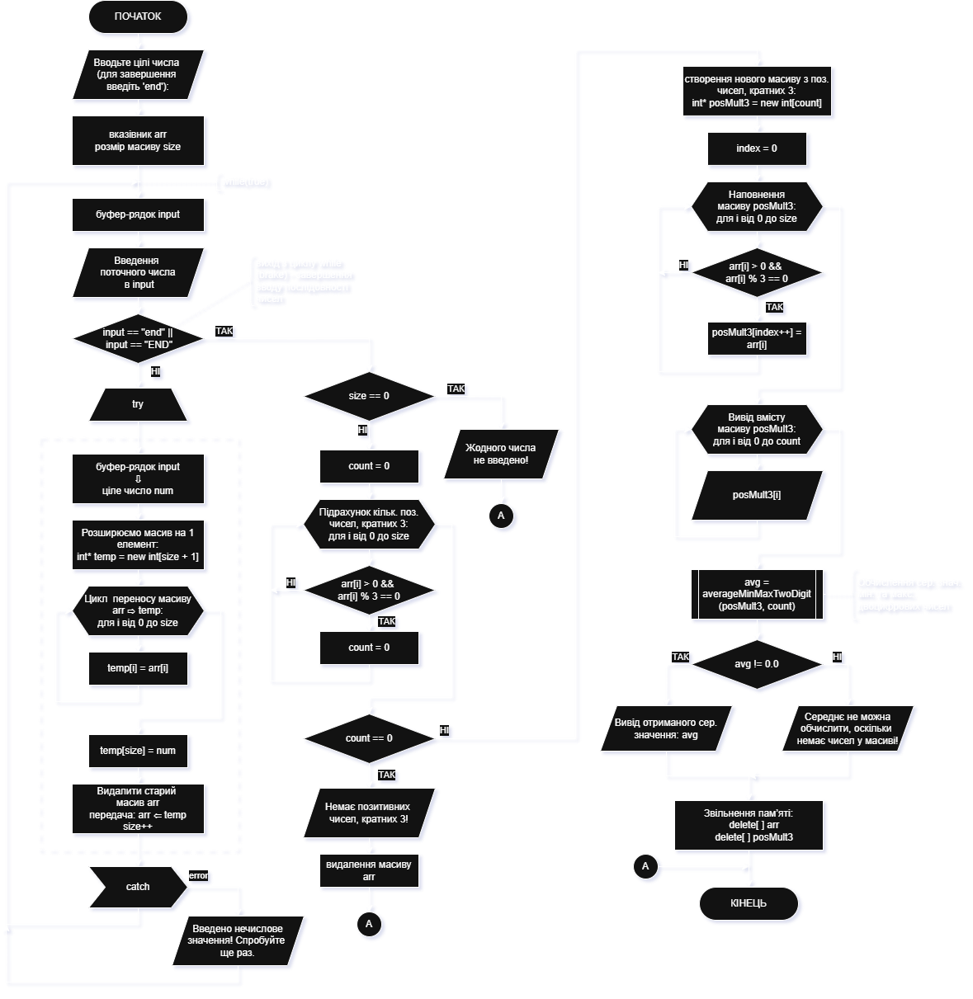
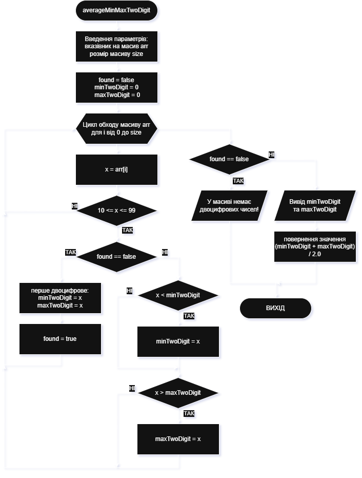

# Приклад виконання завдання ЛР12

## Текст завдання (тестовий варіант)

Скласти блок-схему алгоритму та написати програму на мові С++ для розв’язання завдання відповідно до індивідуального варіанта з опрацювання одновимірних масивів з виділенням динамічної пам’яті. Ввести деяку послідовність цілих чисел і створити динамічний масив лише з позитивних чисел кратних числу 3. За допомогою функції обчислити середнє значення мінімального та максимального двоцифрових чисел. Вивести знайдені числа та їх середнє значення на екран.

## Теоретичні відомості для виконання завдання

- механізм вводу чисел: числа запитуються та вводяться користувачем циклічно доти, доки не буде подано спеціальний сигнал завершення (наприклад кодове слово чи нечисловий символ); в процесі вводу виконується перевірка введених чисел на відповідність умовам завдання (позитивне число, що ділиться на 3 без залишку) та додавання до динамічного масиву у разі відповідності
- адаптація динамічного масиву за умови невідомої кількості даних, що збирається ввести користувач: існує декілька способів вирішити цю задачу - використання бібліотеки `vector` та одноіменного класу (`vector<int> numbers;`), це дозволить додавати довільну кільтість елементів в структуру-вектор, не турбуючись про обмеження розміру фінальної послідовності (додавання за допомогою методу `push_back(buff)`); щодо прикладу використання цього способу див. приклади ([inp_test1.cpp](inp_test1.cpp), [inp_test2.cpp](inp_test2.cpp), [inp_test3.cpp](inp_test3.cpp)), другий спосіб - перестворення динамічного масиву зі збільшеним об'ємом (можна подвоювати, як у прикладі [inp_test4.cpp](inp_test4.cpp)), або перестворювати масив з одним додатковим місцем для нового значення (як виконано в прикладі програми до цього завдання)
- знаходження мінімального та максимального двоцифрових чисел: для цього використовується цикл проходження по масиву зі знаходженням одночасно мін. та макс. чисел; обчислення середнього відбувається за формулою `(minTwoDigit + maxTwoDigit) / 2.0`; підпрограма має вивести три значення (min, max, avg)

## Програма, що виконує завдання

### Текст основної програми

Ось програма на C++, яка виконує поставлене завдання (lab12_main.cpp):

```cpp
#include <iostream>
#include <string>
#include <windows.h> // для SetConsoleOutputCP

using namespace std;

// Функція для обчислення середнього значення мінімального та максимального двоцифрових чисел
double averageMinMaxTwoDigit(const int* arr, int size) {
    bool found = false;
    int minTwoDigit = 0, maxTwoDigit = 0;

    for (int i = 0; i < size; i++) {
        int x = arr[i];
        //if ((x >= 10 && x <= 99) || (x <= -10 && x >= -99)) { // двоцифрове число
        if (x >= 10 && x <= 99) { // двоцифрове позитивне число
            if (!found) {
                minTwoDigit = maxTwoDigit = x; // перше двоцифрове
                found = true;
            } else {
                if (x < minTwoDigit) minTwoDigit = x;
                if (x > maxTwoDigit) maxTwoDigit = x;
            }
        }
    }

    if (!found) {
        cout << "У масиві немає двоцифрових чисел!" << endl;
        return 0.0;
    }

    cout << "Мінімальне двоцифрове число: " << minTwoDigit << endl;
    cout << "Максимальне двоцифрове число: " << maxTwoDigit << endl;

    return (minTwoDigit + maxTwoDigit) / 2.0;
}

int main() {
    // Перемикаємо консоль у UTF-8
    SetConsoleOutputCP(CP_UTF8);

    cout << "Вводьте цілі числа (для завершення введіть 'end'):\n";

    int* arr = nullptr;
    int size = 0;

    while (true) {
        string input;
        cin >> input;

        if (input == "end" || input == "END")
            break;

        try {
            int num = stoi(input);
            // Розширюємо масив
            int* temp = new int[size + 1];
            for (int i = 0; i < size; i++)
                temp[i] = arr[i];
            temp[size] = num;

            delete[] arr;
            arr = temp;
            size++;
        } catch (...) {
            cout << "Введено нечислове значення! Спробуйте ще раз.\n";
        }
    }

    if (size == 0) {
        cout << "Жодного числа не введено!" << endl;
        return 0;
    }

    // Підрахунок кількості позитивних чисел, кратних 3
    int count = 0;
    for (int i = 0; i < size; i++) {
        if (arr[i] > 0 && arr[i] % 3 == 0)
            count++;
    }

    if (count == 0) {
        cout << "Немає позитивних чисел, кратних 3!" << endl;
        delete[] arr;
        return 0;
    }

    // Створення нового масиву з позитивних чисел, кратних 3
    int* posMult3 = new int[count];
    int index = 0;
    for (int i = 0; i < size; i++) {
        if (arr[i] > 0 && arr[i] % 3 == 0)
            posMult3[index++] = arr[i];
    }

    cout << "\nПозитивні числа, кратні 3: ";
    for (int i = 0; i < count; i++)
        cout << posMult3[i] << " ";
    cout << endl;

    // Обчислення середнього значення мінімального та максимального двоцифрових чисел
    double avg = averageMinMaxTwoDigit(posMult3, count);
    if (avg != 0.0) {
        cout << "Середнє значення мінімального та максимального двоцифрових чисел: " << avg << endl;
    } else {
        cout << "Середнє не можна обчислити, оскільки немає чисел у масиві!" << endl;
    }
    
    // Звільнення пам’яті
    delete[] arr;
    delete[] posMult3;

    return 0;
}
```

### Пояснення принципів роботи програми

Програма складається з двох основних функцій:

1. Підпрограма знаходження мінімального та максимального двоцифрових значень в масиві, які діляться на 3 - функція `averageMinMaxTwoDigit(arr, size)`.
2. `main()` - головна функція програми, яка забезпечує введення, перевірку коректності даних, створення та наповнення динамічного масиву числами, які ввів користувач та які відповідають умовам індивідуального завдання - позитивні цілі числа, які діляться на 3.

### Приклад виконання

Приклад роботи програми:

```bash
Вводьте цілі числа (для завершення введіть 'end'):
162 27 -540 -51 -15 45 0 6 13 72 28 -35 156
end

Позитивні числа, кратні 3: 162 27 45 6 72 156
Мінімальне двоцифрове число: 27
Максимальне двоцифрове число: 72
Середнє значення мінімального та максимального двоцифрових чисел: 49.5
```

```bash
Вводьте цілі числа (для завершення введіть 'end'):
36 163 74 -94 75 -327 21 9 -74 -52 -33 81 69 -73 143 END

Позитивні числа, кратні 3: 36 75 21 9 81 69 
Мінімальне двоцифрове число: 21
Максимальне двоцифрове число: 81
Середнє значення мінімального та максимального двоцифрових чисел: 51
```

Можна додатково перевірити комбінації, в яких немає двоцифрових чисел, що діляться на 3, є декілька однакових чисел, послідовність чисел складається з нулів, тощо.

### Схеми алгоритмів програми

Схеми алгоритмів основної програми `main()` (файл **lab12_main.cpp**) та підпрограми `averageMinMaxTwoDigit(arr, size)`.

Алгоритм основної програми `main()`



Алгоритм підпрограми `averageMinMaxTwoDigit(arr, size)`


