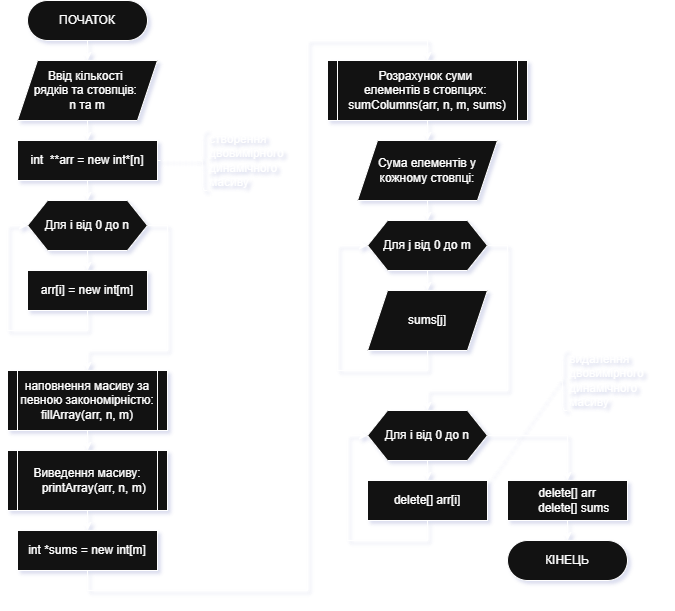
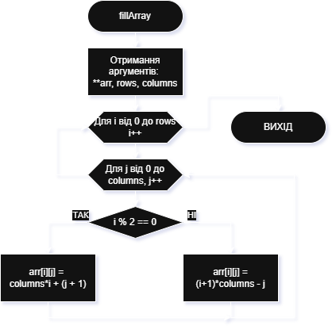
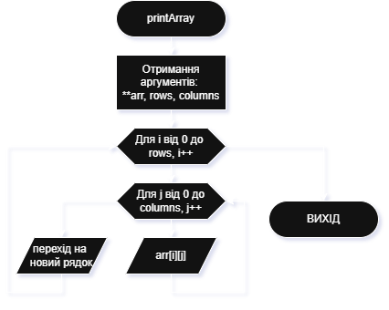
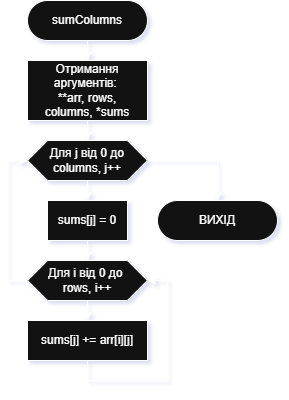
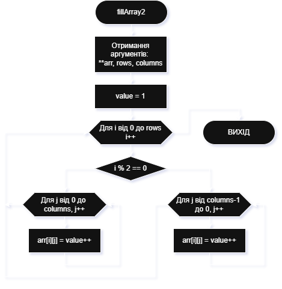

# Приклад виконання завдання ЛР13

## Текст завдання (тестовий варіант)

Скласти блок-схему алгоритму та написати програму на мові С++ для розв’язання наступного завдання:
Ввести параметри розмірністі двовимірного масиву: кількість рядків `N` та кількість стовпців `M`. За зазначеними параметрами створити створити динамічний масив та заповнити його за певним законом відповідно до індивідуального варіанта. У програмі має бути реалізовано як мінімум три функції (підпрограми):

1) функція заповнення масиву;
2) функція виведення масиву на екран;
3) функція знаходження сум елементів масиву у кожному стовпці.

Тестовий варіант двовимірного масиву:

```bash
 1  2  3  4  5  6  7  8
16 15 14 13 12 11 10  9
17 18 19 20 21 22 23 24
32 31 30 29 28 27 26 25
33 34 35 36 37 38 39 40
48 47 46 45 44 43 42 41
```

## Теоретичні відомості для виконання завдання

- як задаються динамічні маси у мові С++, та як саме задаються двовимірні динамічні масиви
- визначення закономірностей заповнення масиву відповідно до індивідуального варіанту (масив заповнюється значенням постійно зростаючого лічильника, починаючи зі значення 1, наступним чином: позиції в рядках з парним індексом заповнюються в прямому порядку (в порядку зростання індексу стовпця), а позиції в рядках з непарним індексом - у зворотньому порядку; додати формули закономірностей заповнення значень у масив)
- спосіб передачі динамічного двовимірного масиву у підпрограми.

## Програма, що виконує завдання

### Текст основної програми

Ось програма на C++, яка виконує поставлене завдання (lab13_main.cpp):

```cpp
#include <iostream>
#include <iomanip>
#include <windows.h> // для SetConsoleOutputCP

using namespace std;

void fillArray(int **arr, int rows, int columns);
void fillArray2(int **arr, int rows, int columns);
void printArray(int **arr, int rows, int columns);
void sumColumns(int **arr, int rows, int columns, int *sums);

int main() {
    // Перемикаємо консоль у UTF-8
    SetConsoleOutputCP(CP_UTF8);
    
    // Вводимо розмірність масиву N*M
    int n, m;
    cout << "Введіть кількість рядків (N): ";
    cin >> n;
    cout << "Введіть кількість стовпців (M): ";
    cin >> m;

    // створюємо двовимірний динамічний масив
    int  **arr = new int*[n];
    for (int i=0; i<n; i++) {
        arr[i] = new int[m];
    }

    // наповнення масиву за певною закономірністю
    // fillArray(arr, n, m);
    fillArray2(arr, n, m);

    // Виведення масиву
    printArray(arr, n, m);

    // Розрахунок суми елементів в стовпцях
    int *sums = new int[m];
    sumColumns(arr, n, m, sums);

    // Виведення сум по стовпцях
    cout << "\nСума елементів у кожному стовпці:" << endl;
    for (int j = 0; j < m; j++)
        cout << setw(4) << sums[j];
    cout << endl;

    // звільнення пам’яті
    for (int i = 0; i < n; i++)
        delete[] arr[i];
    delete[] arr;
    delete[] sums;

    return 0;
}

// 1) Функція заповнення масиву
void fillArray(int **arr, int rows, int columns) {
    for (int i=0; i<rows; i++) {
        for (int j=0; j<columns; j++) {
            if (i % 2 == 0) {
                arr[i][j] = columns*i + (j + 1);
            } else {
                arr[i][j] = (i+1)*columns - j;
                // arr[i][j] = i*columns + (columns - j);
            }
        }
    }
}

// 1) Функція заповнення масиву -- альтернативний варіант
void fillArray2(int **arr, int rows, int columns) {
    int value = 1; // лічильник - значення елементу
    for (int i = 0; i < rows; i++) {
        if (i % 2 == 0) {
            // парний рядок — зліва направо
            for (int j = 0; j < columns; j++)
                arr[i][j] = value++;
        } else {
            // непарний рядок — справа наліво
            for (int j = columns - 1; j >= 0; j--)
                arr[i][j] = value++;
        }
    }
}

// 2) Функція виведення масиву
void printArray(int **arr, int rows, int columns) {
    for (int i = 0; i < rows; i++) {
        for (int j = 0; j < columns; j++)
            cout << setw(4) << arr[i][j];
        cout << endl;
    }
}

// 3) Функція знаходження суми у стовпцях
void sumColumns(int **arr, int rows, int columns, int *sums) {
    for (int j = 0; j < columns; j++) {
        sums[j] = 0;
        for (int i = 0; i < rows; i++)
            sums[j] += arr[i][j];
    }
}
```

### Пояснення принципів роботи програми

Програма складається з основної функції (main) та наступних підпрограм:

- підпрограма `fillArray()`
- підпрограма `fillArray2()`
- підпрограма `printArray()`
- підпрограма `sumColumns()`

1. Підпрограма `fillArray()` - заповнює динамічний масив значеннями відповідно до закону, визначеного індивідуальним варіантом. Значення для заповнення вираховуються динамічно за формулами в залежності від розмірів масиву (кількості стовпців) та поточних значень індексів ціклів обходу елементів.
2. Підпрограма `fillArray2()` - виконує аналогічну задачу, як і підпрограма `fillArray()` (альтернативний варіант реалізації), але заповнення елементів масиву відбувається значеннями постійно зростаючого лічильника, в програмі змінено поряд обходження елентів масиву
3. Підпрограма `printArray()` - виконує виведення вмісту масиву на екран
4. Підпрограма `sumColumns()` - виконує обчислення сум елементів по стовцях масиву, результат записується в одномірний масив
5. `main()` - головна функція програми, яка забезпечує введення, перевірку коректності даних, створення та наповнення динамічного масиву числами (через виклик підпрограми `fillArray()`), розмірність якого ввів користувач, виведення вмісту масиву на екран (через виклик підпрограми `printArray()`), обчислення та виведення на екран сум елементів по стовцях масиву, а також знищення масиву та вивільнення пам'ті, що він займав, у кінці виконання програми.

### Приклад виконання

Приклади роботи програми:

```bash
Введіть кількість рядків (N): 6
Введіть кількість стовпців (M): 8
   1   2   3   4   5   6   7   8
  16  15  14  13  12  11  10   9
  17  18  19  20  21  22  23  24
  32  31  30  29  28  27  26  25
  33  34  35  36  37  38  39  40
  48  47  46  45  44  43  42  41

Сума елементів у кожному стовпці:
 147 147 147 147 147 147 147 147
```

```bash
Введіть кількість рядків (N): 7
Введіть кількість стовпців (M): 5
   1   2   3   4   5
  10   9   8   7   6
  11  12  13  14  15
  20  19  18  17  16
  21  22  23  24  25
  30  29  28  27  26
  31  32  33  34  35

Сума елементів у кожному стовпці:
 124 125 126 127 128
```

### Схеми алгоритмів програми

Схеми алгоритмів основної програми `main()` (файл **lab13_main.cpp**) та підпрограм `fillArray()`, `fillArray2()`, `printArray()`, `sumColumns()`.

Алгоритм основної програми `main()`



Алгоритм підпрограми `fillArray()`



Алгоритм підпрограми `printArray()`



Алгоритм підпрограми `sumColumns()`



Альтернативний варіант підпрограми заповнення масиву `fillArray2()`


