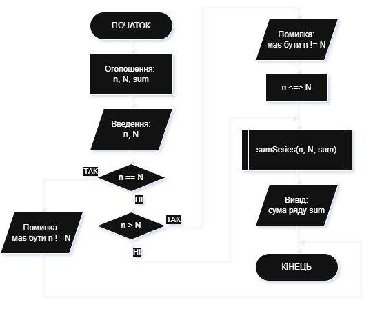
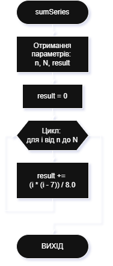

# Приклад виконання завдання ЛР14

## Текст завдання (тестовий варіант - варіант 20)

Скласти блок-схему алгоритму та написати програму на мові С++ для розв’язання наступного завдання:
Написати програму, в якій в функції визначається сума ряду:

$$\sum_{i=n}^{N} \frac{i(i-7)}{8}$$

Параметр функції – номери початкового (n) та кінцевого (N) члена ряду, для передачі результатів її роботи використовувати передачу параметрів за посиланням та (або) покажчиком.

## Теоретичні відомості для виконання завдання

1. Передавання параметрів функції за допомогою покажчика:

Покажчик — це змінна, що зберігає адресу комірки іншої змінної. Функція оголошується як `void func(int *var)`, а при виклику функції вказується `func(&x)`, тобто у функцію потрапляє адреса комірки для змінної `x`. Усередині функції `var` — це адреса `x`, `*var` — це саме значення `x`. Операції над `*var` змінюють значення за адресою у `var`, тобто значення `x`.

2. Передавання параметрів функції за допомогою посилання:

Посилання — це інше ім'я для тієї ж змінної. В мовах С та С++ посилання позначається як `&var`. Коли певна функція визначена як `void func(int &var)`, а в основній програмі вона викликається як `func(x)`, то змінна `x` не копіюється, а передається безпосередній доступ до неї. Всередині функції `var` — це та сама комірка, що й `x` у головній програмі. Будь-яке присвоєння `var = 123` фактично змінює значення `x`.

## Програма, що виконує завдання

### Текст основної програми

Ось програма на C++, яка виконує поставлене завдання з передаванням параметрів за допмогою покажчика (lab14_main_pointer.cpp):

```cpp
#include <iostream>

using namespace std;

void sumSeries(int n, int N, double *result) {
    *result = 0.0;
    for (int i = n; i <= N; i++) {
        *result += (i * (i - 7)) / 8.0;
    }
}

int main() {
    int n, N;
    double sum;

    cout << "Введіть n (початкове значення діапазону): ";
    cin >> n;
    cout << "Введіть N (кінцеве значення діапазону): ";
    cin >> N;

    if (n == N) {
        cout << "[x] n та N не можуть бути однаковими!";
        return 0;
    } 
    if (n > N) {
        cout << "[!] n не може бути більше N - змінюємо n <=> N"  << endl;
        swap(n, N);
    }

    sumSeries(n, N, &sum);

    cout << "Сума ряду = " << sum << endl;
    return 0;
}
```

Ось програма на C++, яка виконує поставлене завдання з передаванням параметрів за допмогою посилання (lab14_main_link.cpp):

```cpp
#include <iostream>
using namespace std;

void sumSeries(int n, int N, double &result) {
    result = 0.0;
    for (int i = n; i <= N; i++) {
        result += (i * (i - 7)) / 8.0;
    }
}

int main() {
    int n, N;
    double sum;

    cout << "Введіть початковий n (початкове значення діапазону): ";
    cin >> n;
    cout << "Введіть кінцевий N (кінцеве значення діапазону): ";
    cin >> N;

    if (n == N) {
        cout << "[x] n та N не можуть бути однаковими!";
        return 0;
    } 
    if (n > N) {
        cout << "[!] n не може бути більше N - змінюємо n <=> N" << endl;
        swap(n, N);
    }

    sumSeries(n, N, sum);

    cout << "Сума ряду = " << sum << endl;
    return 0;
}
```

### Пояснення принципів роботи програми

1. Принцип роботи програми з покажчиком. Програма запитує від користувача два числа `n` і `N` — початкове та кінцеве значення діапазону, на якому будуть розраховуватись значення ряду. Для коректної роботи програми слід, щоб введені числа задовільняли двом умовам: `n != N` та `n < N`. Для цього виконуються перевірки і виправлення.Викликається підпрограма `sumSeries()`, до якої передаються отримані межі `n` і `N`, а також адреса змінної `sum` — `&sum`, тому що програма працює з покажчиком на змінну — `*result`. У підпрограмі обчилюється сума ряду, вона накопичується безпосередньо у змінній за покажчиком. По завершенні роботи підпрограми і поверненні в основну програму в змінній `sum` вже міститься сума ряду на зазначеному діапазоні. Вона виводиться у консоль.

2. Принцип роботи програми з посиланням. Програма запитує від користувача два числа `n` і `N` — початкове та кінцеве значення діапазону, на якому будуть розраховуватись значення ряду. Для коректної роботи програми слід, щоб введені числа задовільняли двом умовам: `n != N` та `n < N`. Для цього виконуються перевірки і виправлення.Викликається підпрограма `sumSeries()`, до якої передаються отримані межі `n` і `N`, а також змінна `sum`. В самій підпрограмі проводиться робота з посиланням на на змінну `sum`, а не з копією, як це робиться для перших двох параметрів. Обчилюється сума ряду, вона накопичується безпосередньо у змінній завдяки використання посилання. По завершенні роботи підпрограми і поверненні в основну програму в змінній `sum` вже міститься сума ряду на зазначеному діапазоні. Вона виводиться у консоль.

### Приклад виконання

Приклади роботи програми, де параметри передаються за допомогою вказівника (lab14_main_pointer.cpp):

```bash
Введіть n (початкове значення діапазону): 3
Введіть N (кінцеве значення діапазону): 23
Сума ряду = 301
----
Введіть n (початкове значення діапазону): 5
Введіть N (кінцеве значення діапазону): 5
[x] n та N не можуть бути однаковими!
----
Введіть n (початкове значення діапазону): 34
Введіть N (кінцеве значення діапазону): 4
[!] n не може бути більше N - змінюємо n <=> N
Сума ряду = 1193.5
```

Приклади роботи програми, де параметри передаються за допомогою посилання (lab14_main_link.cpp):

```bash
Введіть початковий n (початкове значення діапазону): 3
Введіть кінцевий N (кінцеве значення діапазону): 23
Сума ряду = 301
----
Введіть початковий n (початкове значення діапазону): 2
Введіть кінцевий N (кінцеве значення діапазону): 2
[x] n та N не можуть бути однаковими!
----
Введіть початковий n (початкове значення діапазону): 34
Введіть кінцевий N (кінцеве значення діапазону): 4
[!] n не може бути більше N - змінюємо n <=> N
Сума ряду = 1193.5
```

### Схеми алгоритмів програми

Схеми алгоритмів основної програми `main()` (файл **lab14_main.cpp**) та підпрограми `sumSeries()`.

Алгоритм основної програми `main()`



Алгоритм підпрограми `sumSeries()`


